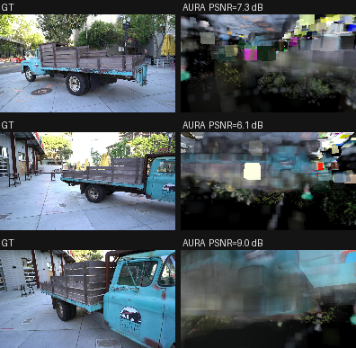

# AURA-Core

**AURA** (Adaptive Unified Radiance Asset) is a post-3DGS 3D scene
reconstruction engine. It trains a mixed adaptive carrier representation
directly from posed image, depth, mask, and normal captures and exports a
queryable `.aura` scene package.

```text
COLMAP / MVS  →  NeRF  →  3D Gaussian Splatting  →  AURA
```

Rather than optimizing a single primitive type across the entire scene, AURA
assigns each spatial region the most appropriate carrier from a typed family
(surface, volume, beta kernel, gabor/frequency, neural residual, semantic, or
Gaussian fallback). Carriers evolve during training through split, promote,
merge, and demote decisions driven by measured residuals. The result is an
auditable, ray-queryable scene representation with native support for
confidence, geometry proxies, semantic grouping, and LOD.

See [docs/ARCHITECTURE.md](docs/ARCHITECTURE.md) for the full design rationale
and carrier-family descriptions.

## Results (Tanks & Temples — Truck, real data)

Ground truth (left) vs AURA render (right), three eval frames:



| Run | Carriers | Iterations | PSNR | SSIM | Notes |
|---|---|---|---|---|---|
| AURA truck-3k-run6 | 129,531 | 3,000 | **6.89 dB** | 0.044 | converged checkpoint, 0.125× eval |
| 3DGS (Kerbl 2023) | — | 30,000 | ~25.19 dB | ~0.879 | reference |

> **Honest status:** these are *real* numbers from a real converged checkpoint
> evaluated with the on-GPU CUDA renderer (the eval fails loudly rather than
> mislabelling a CPU fallback). They are also **far from competitive** — the
> 3,000-iteration run is badly under-converged. Training *does* optimise
> (≈23k/129k carriers updated their opacity/colour/mean), but with the
> memory-constrained target sampling (256 targets/batch, 16/frame) most
> carriers never receive a gradient and the per-iteration loss stays
> noisy-flat (~0.03). Reaching 3DGS-class quality needs far more iterations
> and/or denser supervision. Reproduce with:
>
> ```bash
> python scripts/eval_psnr.py outputs/truck-3k-run6.aura \
>     outputs/truck-pts129k-manifest.json --frames 5 --renderer cuda --scale 0.125
> python scripts/render_comparison.py outputs/truck-3k-run6.aura \
>     outputs/truck-pts129k-manifest.json --out docs/aura_truck_comparison.png
> ```

## Features

- Native carrier registry for surface, volume, beta, gabor, neural residual,
  semantic, and Gaussian fallback carriers with typed payload validation.
- `.aura` package writer, loader, and runtime JSON Schema validator covering
  manifest, elements, chunks, exchange, semantic graph, and training records.
- Capture manifest format for posed image / depth / mask / normal assets with
  COLMAP sparse-model import (`aura colmap-to-capture-manifest`).
- Packed capture tensor loading for PNG, PPM/PGM, COLMAP dense maps, and
  optional `imageio` EXR/HDR/video backends.
- Tiled PyTorch optimization (`aura train`) with device-resident asset batching,
  mask-aware pixel sampling, camera ray construction, configurable loss weights,
  gradient clipping, and checkpoint/resume support.
- Grouped torch ray/carrier intersections for all carrier types with ordered
  front-to-back compositing across color, alpha, depth, normal, confidence,
  material, semantics, residual, and hit outputs.
- Compiled CUDA renderer dispatched via pybind11 `render_rays` over packed
  scene and ray tensors, with measured per-carrier parity against the PyTorch
  renderer.
- Production GPU BVH traversal kernel (`render_rays_bvh`) using a flattened
  binned-SAH element BVH (median-split fallback), replacing the brute-force scan.
- Anti-aliasing for the torch renderer: Mip-Splatting-style 3D frequency cap,
  ray-cone footprint prefilter, and 2x2 supersampling (all opt-in), plus
  early-transmittance termination for energy-conserving compositing.
- Per-attribute Adam optimization with per-group learning-rate schedules,
  alongside the existing SGD path; gradient-magnitude (AbsGS) accumulation,
  opacity reset/recovery signals, importance scores (RadSplat), carrier budget
  ceilings, and optional depth-distortion / normal-consistency losses (2DGS).
- SOTA carrier upgrades (opt-in, defaults preserve prior behavior): deformable
  Beta kernels, multi-directional Gabor filter banks, Scaffold-GS-style anchored
  neural-residual carriers, and LangSplat-style sparse-codebook semantic
  features.
- Semantic-graph-governed heterogeneous carrier allocation (`aura.allocation`):
  scene-graph clustering selects the carrier type per region, with soft
  inter-type conversion scores, cross-carrier residual hooks, and a
  single-carrier ablation mode for typed-mix-vs-baseline studies.
- Physically based shading and relighting (`aura.shading`): Lambertian,
  Cook-Torrance microfacet with split-sum IBL, and BVH shadow-ray visibility
  baking, with per-carrier albedo/roughness/metallic and a relighting demo path
  (emissive output unchanged when shading is disabled).
- CUDA-vs-torch runtime benchmark (`aura benchmark-cuda-runtime`) measuring
  on-device throughput and cross-backend parity.
- EXR/PFM float radiance export and turntable video export (MP4 via
  `imageio[ffmpeg]` or system `ffmpeg`, with PNG frame-sequence fallback).
- Long-run memory stability probe tracking tracemalloc and torch CUDA
  allocations across many iterations.
- Real-scene benchmark harness scoring an `.aura` package against external
  COLMAP/NeRF/3DGS baseline renders (PSNR/SSIM/LPIPS-proxy JSON report).

## Maturity

All capabilities above are implemented and covered by the deterministic test
suite. The advanced optimization, anti-aliasing, carrier, allocation, and
shading paths are validated on fixtures and gated behind opt-in configuration so
that default behavior is unchanged. Quantitative quality and performance claims
against COLMAP / NeRF / 3DGS baselines require running `aura benchmark-real-scene`
on external datasets and have not yet been published. The
semantic-graph-governed allocation framework provides working graph-driven
carrier selection plus the differentiable inter-type-conversion and
cross-carrier residual structure; learning those assignments end-to-end is a
training-time step that runs once real captures are supplied.

## Requirements

- Python 3.11+
- PyTorch 2.3+ (for GPU training and the torch renderer)
- CUDA toolkit (for the compiled CUDA renderer; optional)
- `imageio[assets]` (for EXR export and video; optional)

## Install

```bash
python -m venv .venv
source .venv/bin/activate
pip install --upgrade pip
pip install -e ".[dev,gpu,assets]"
```

The `gpu` extra adds PyTorch. The `assets` extra adds `imageio` for EXR and
video support. The `dev` extra adds pytest.

### CUDA Renderer

After installing on a GPU machine:

```bash
export CUDA_VISIBLE_DEVICES=0
aura torch-renderer-status
aura cuda-kernel-build-report --build
```

`cuda-kernel-build-report` compiles and loads the pybind11 extension and
reports `compiled: true, loadable: true` when the CUDA renderer is available.

## Quickstart

### 1. Verify the installation

```bash
python -m pytest -q
aura build-native-demo --output-dir outputs/native-demo.aura
aura render outputs/native-demo.aura --backend torch --output outputs/native-demo.ppm
aura benchmark-ray-query outputs/native-demo.aura --native-demo-expectations
```

### 2. Create a capture manifest

```bash
aura write-capture-manifest-template --output outputs/capture-manifest.json
```

Edit the template to reference your posed images, depth maps, masks, and
normals. Or import from a COLMAP sparse model:

```bash
aura colmap-to-capture-manifest data/custom-captures/<scene>/colmap \
  --root data/custom-captures/<scene> \
  --output outputs/capture-from-colmap.json
```

### 3. Inspect and plan sampling

```bash
aura inspect-capture-tensors data/custom-captures/<scene>/capture-manifest.json
aura plan-capture-sampling data/custom-captures/<scene>/capture-manifest.json \
  --tile-size 256 --pixel-stride 8 --max-targets-per-frame 4096
```

### 4. Train

```bash
aura train data/custom-captures/<scene>/capture-manifest.json \
  --device cuda \
  --output outputs/scene.aura \
  --iterations 8 \
  --tile-size 256 \
  --pixel-stride 8 \
  --max-targets-per-frame 4096 \
  --max-targets-per-batch 1024 \
  --image-loss-weight 1.0 \
  --depth-loss-weight 1.0 \
  --query-loss-weight 1.0 \
  --normal-loss-weight 1.0 \
  --mask-loss-weight 1.0 \
  --confidence-loss-weight 1.0 \
  --checkpoint-interval 2
```

Training writes `training_report.json`, optional checkpoint packages, and the
optimized `.aura` package under the selected output directory.

### 5. Resume from a checkpoint

```bash
aura train data/custom-captures/<scene>/capture-manifest.json \
  --device cuda \
  --output outputs/scene-resumed.aura \
  --resume-from outputs/scene.aura/checkpoints/iter_000001.aura
```

## Rendering and Querying

```bash
# Validate and inspect a package
aura validate-package outputs/scene.aura
aura inspect-package outputs/scene.aura

# Render (PPM, EXR, or PFM)
aura render outputs/scene.aura --backend torch --device cuda \
  --output outputs/scene.ppm --width 256 --height 256
aura render outputs/scene.aura --format exr \
  --output outputs/scene.exr --width 256 --height 256

# Turntable video
aura render-video outputs/scene.aura --output outputs/turntable.mp4 \
  --frames 48 --fps 24

# Benchmarks
aura benchmark-reference outputs/scene.aura --width 64 --height 64
aura benchmark-visual outputs/scene.aura outputs/reference.ppm --min-psnr 30
aura benchmark-real-scene outputs/scene.aura \
  --reference-dir data/baselines/<scene> --baseline-label 3dgs --min-psnr 25

# Memory stability
aura memory-stability-probe outputs/scene.aura --iterations 256
```

EXR export requires `imageio[assets]`; without it `--format exr` writes a
stdlib `.pfm` float raster instead. `aura render-video` writes MP4 when an
encoder is available, otherwise a PNG/PPM frame sequence plus a
`sequence.json` manifest.

## Fixture Smoke Tests

These commands exercise small deterministic fixtures without requiring external
datasets:

```bash
aura build-native-demo --output-dir outputs/native-demo.aura
aura render outputs/native-demo.aura --backend torch --output outputs/native-demo.ppm
aura benchmark-ray-query outputs/native-demo.aura --native-demo-expectations
aura write-training-frames-demo --output outputs/training-frames.json
aura reconstruct-demo \
  --frames outputs/training-frames.json \
  --output-dir outputs/reconstruct-demo.aura \
  --iterations 6 \
  --render-backend torch
python -m pytest
```

## Repository Map

```text
src/aura/
  cli.py               CLI — train, render, ingest-adapters, benchmark, inspect commands
  core.py              Reconstruction contracts and adaptive evolution policy
  torch_renderer.py    Torch render batches, grouped carrier hits, compositing
  torch_optimizer.py   Tiled capture optimization and checkpoint snapshots
  torch_kernels.py     Carrier parameter tensors and differentiable responses
  cuda_renderer.py     CUDA renderer ABI and dispatch boundary
  cuda/                CUDA kernels and pybind11 extension sources
  ingest/              Capture, COLMAP, 3DGS, depth, and semantic adapters
  package.py           .aura package IO and validation
  scene.py             Ray-query traversal and response assembly
  schemas/             JSON Schema files for runtime validation
tests/                 Deterministic contract, optimizer, renderer, CLI tests
docs/
  ARCHITECTURE.md      Design rationale, carrier families, pipeline overview
```

`src/aura/ingest/` is an adapter boundary. 3DGS exports become `EvidenceSample`
records and survive only as Gaussian fallback carriers when native carrier
assignment does not justify a stronger representation. All 3DGS-specific logic
stays under `aura.ingest`.

## Data Layout

Keep datasets, checkpoints, renders, and third-party baselines out of git:

```text
data/
  custom-captures/<scene>/
    capture-manifest.json
    images/
    depth/
    masks/
    normals/
    colmap/
third_party/
  gaussian-splatting/
  gsplat/
  nerfstudio/
outputs/          (generated packages, renders, and reports — git-ignored)
```

Baseline datasets (Mip-NeRF 360, Tanks and Temples, Deep Blending, and 3DGS /
nerfstudio exports) are obtained from their original sources and kept under the
git-ignored `data/` and `third_party/` directories. Score a trained package
against external baseline renders with `aura benchmark-real-scene`.

## Development

```bash
pip install -e ".[dev]"
python -m pytest -q
```

- Keep generated `.aura` packages, datasets, checkpoints, renders, and secrets
  out of git (all covered by `.gitignore`).
- All 3DGS-specific logic must remain under `aura.ingest`; splats are evidence
  inputs, not native representation elements.
- New ingest sources must produce `EvidenceSample` records before
  decomposition.

## License

MIT License. See [LICENSE](LICENSE) for details.
