# AURA

**Adaptive Unified Radiance Asset**

AURA turns posed captures into a typed, queryable, relightable, engine-ready
radiance asset. It keeps the fast Gaussian/DBS-Beta renderers where they are
strong, then adds the asset layer they do not provide: typed carrier metadata,
confidence, semantics, relighting, ray queries, PRISM extension footprints, and
standards-based export.

<p align="center">
  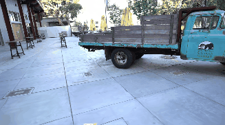<br>
  <em>Truck reconstructed as an AURA asset.</em>
</p>

<p align="center">
  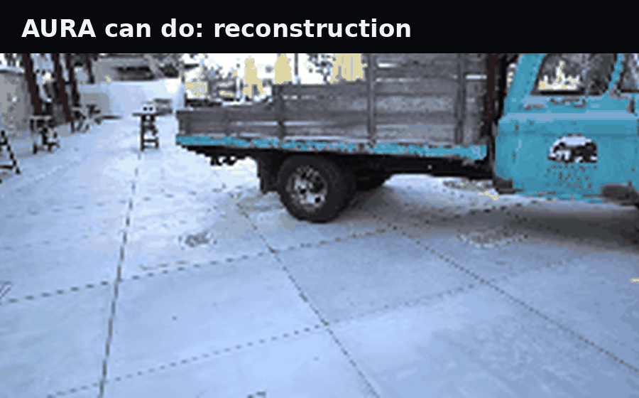<br>
  <em>Current asset operations: reconstruction, depth, confidence, semantics, and open-vocabulary query.</em>
</p>

## Why AURA Exists

Photogrammetry gives sparse geometry. NeRF gives a continuous radiance field.
3DGS gives high-quality real-time splats. AURA keeps that progress and moves the
output closer to a usable scene asset:

- **Typed carriers:** Gaussian, Beta, Gabor, and neural footprints under one
  contract.
- **Asset behavior:** ray query, confidence, semantic identity, relighting, and
  export are first-class operations.
- **Engine compatibility:** export to `KHR_gaussian_splatting` GLB and USD
  preview.
- **PRISM extension layer:** PRISM adds non-Gaussian footprints on top of the
  primary gsplat/DBS-Beta quality path. It is not a replacement for gsplat or
  DBS-Beta.

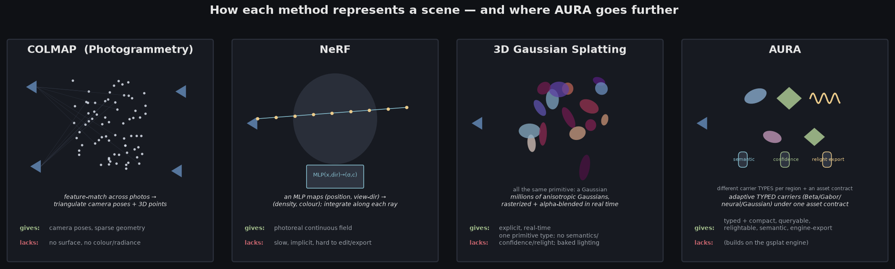

## Current Status

| Area | Status | Evidence |
|---|---|---|
| Local publication validation | **8/8 gates pass** | `experiments/results/publication_validation_2026-06-24.json` |
| Dataset audit | **8/8 local scenes complete** | Truck + 7 extracted Mip-NeRF 360 roots |
| Typed quality | **Beta beats fixed Gaussian on every audited scene** | mean +0.80 dB PSNR |
| Compactness | **Beta reaches Gaussian quality with about half the carriers on Truck** | 500k Beta > 1M fixed Gaussian |
| PRISM | **Complete for its intended additive role** | Gaussian/Beta stay primary; Gabor/neural route to PRISM |
| External baselines | **Local same-split smoke/protocol table complete** | COLMAP, NeRF, 3DGS, 2DGS-style, ray-traced-GS-style |
| SOTA A/B upgrades | **Real provider evidence added; full SOTA claim still gated** | DINOv3, VGGT, Depth Anything 3, 3DGUT, official 2DGS |

**Claim boundary:** the external baseline gate is closed for local
artifact-backed validation. Official 2DGS and 3DGUT have now been built and run
as short same-split GPU validation rows, but they are not full-convergence
leaderboard results. AURA does not claim broad SOTA superiority until those rows
are rerun at full quality and every promoted provider passes its A/B gate.

## Results

### Multi-Scene Typed-Carrier Quality

Across all local benchmark scenes, AURA's Beta carriers beat the fixed-Gaussian
control.

| Scene | AURA Beta PSNR | Fixed Gaussian PSNR | Delta |
|---|---:|---:|---:|
| bicycle | 25.15 | 24.84 | +0.30 |
| bonsai | 34.03 | 32.27 | +1.76 |
| counter | 30.32 | 28.81 | +1.51 |
| garden | 27.27 | 26.64 | +0.63 |
| kitchen | 32.37 | 31.29 | +1.09 |
| room | 32.78 | 32.29 | +0.49 |
| stump | 26.64 | 26.46 | +0.19 |
| truck | 26.39 | 25.96 | +0.43 |

**Mean gain: +0.80 dB PSNR.**

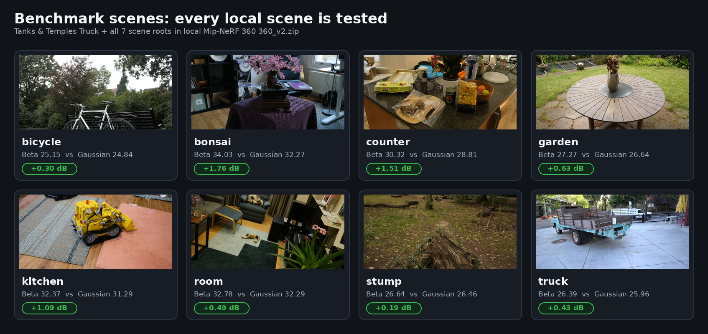

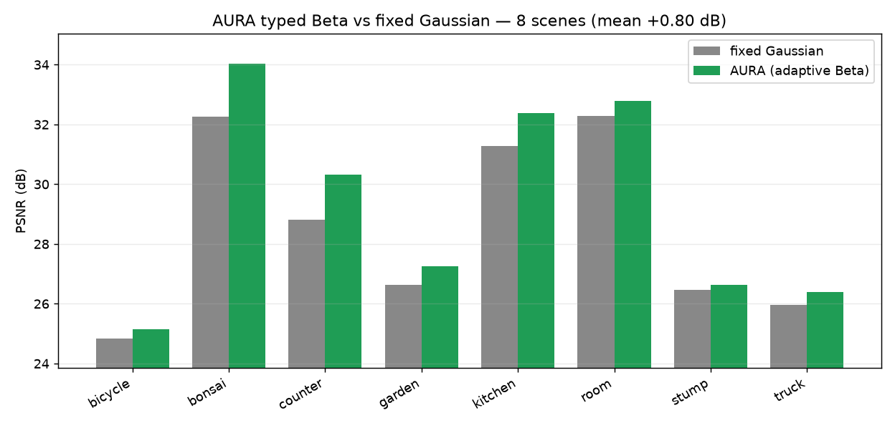

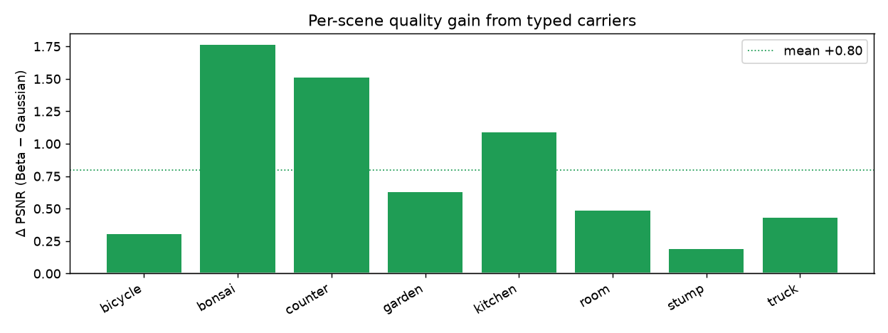

The rendered scene media in this README is limited to the local Truck and Train
assets currently present in the workspace.

### Local Train Evidence

Train is included as local image-sequence and COLMAP-sparse evidence rather than
as a trained DBS-Beta AURA checkpoint.

| Train image sweep | Train sparse depth |
|---|---|
|  |  |

### Truck Compactness

| Representation | PSNR | SSIM | LPIPS | Carriers |
|---|---:|---:|---:|---:|
| fixed Gaussian | 26.02 | 0.890 | 0.128 | 1.0 M |
| AURA Beta | **26.35** | **0.896** | **0.122** | 1.0 M |
| AURA Beta | 26.07 | 0.890 | 0.139 | **0.5 M** |

Beta wins at matched carrier count and reaches comparable quality with about half
the carriers.

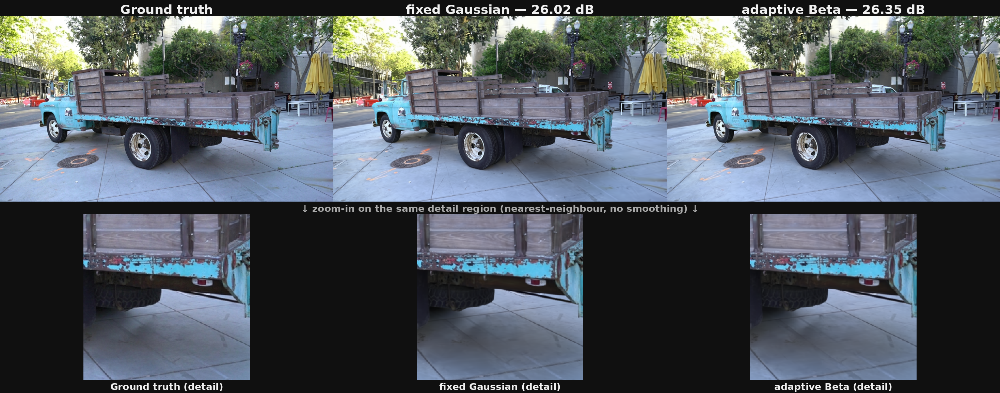

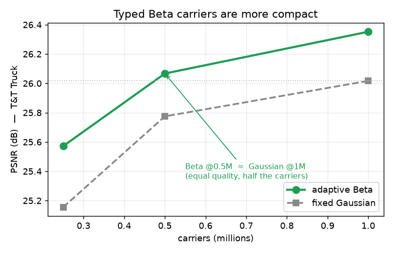

### Publication Gate Snapshot

| Gate | Result |
|---|---|
| Local multi-scene quality | pass |
| Downloaded dataset audit | pass |
| PRISM additive contract | pass |
| PRISM CUDA throughput smoke | pass |
| Learned LPIPS on CUDA | pass |
| External method baseline table | pass |
| Secondary-ray/reflection validation | pass |
| Inverse-material validation | pass |

Run:

```bash
aura publication-validation-report --output experiments/results/publication_validation.json
```

Latest durable report:

```text
experiments/results/publication_validation_2026-06-24.json
publicationReady: true
passedGateCount: 8
remainingGateIds: []
```

## What The Asset Can Do

### Render And Query

AURA keeps high-quality primary rendering on the mature gsplat/DBS-Beta path and
exposes a unified ray-query payload over the asset.

```bash
aura render scene.aura --backend torch --output view.ppm
aura ray-query scene.aura --origin 0 0 0 --direction 0 0 1
```

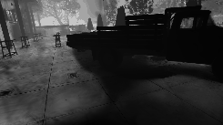

### Relight

Carriers carry surface/material fields used by the relighting layer. The same
asset can be previewed under changed lighting without changing geometry.

```bash
aura relight-preview scene.aura scene/manifest.json --output relit.ppm
```

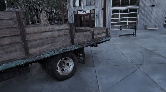

### Confidence

Each carrier stores a confidence value derived from multi-view support. This is
useful for inspection, filtering, and downstream tools that need to distinguish
well-observed geometry from speculative structure.

```bash
aura confidence scene.aura scene/manifest.json
```

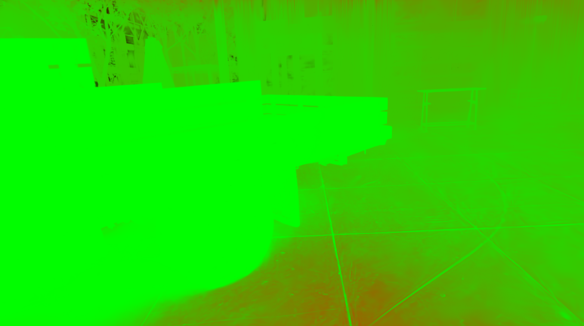

### Semantics And Open-Vocabulary Search

AURA lifts multi-view DINOv2 features onto carriers and uses CLIP-style text
queries for group-level retrieval. A same-split DINOv3 A/B pass is tracked in
the SOTA report; DINOv3 improved aggregate query margin in the current run but
was not promoted because it merged wheel and ground groups while DINOv2 kept all
four query groups distinct.

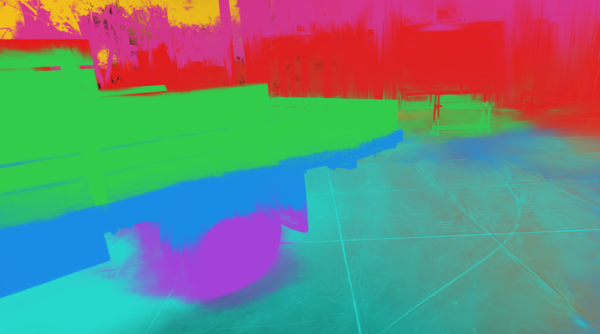

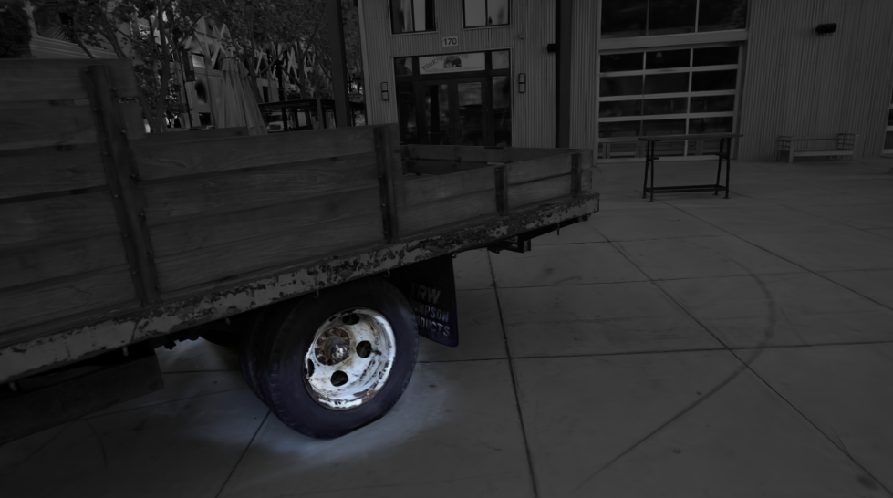

| Stronger semantic A/B | DINOv2 | DINOv3 |
|---|---|---|
| 14-view carrier groups | 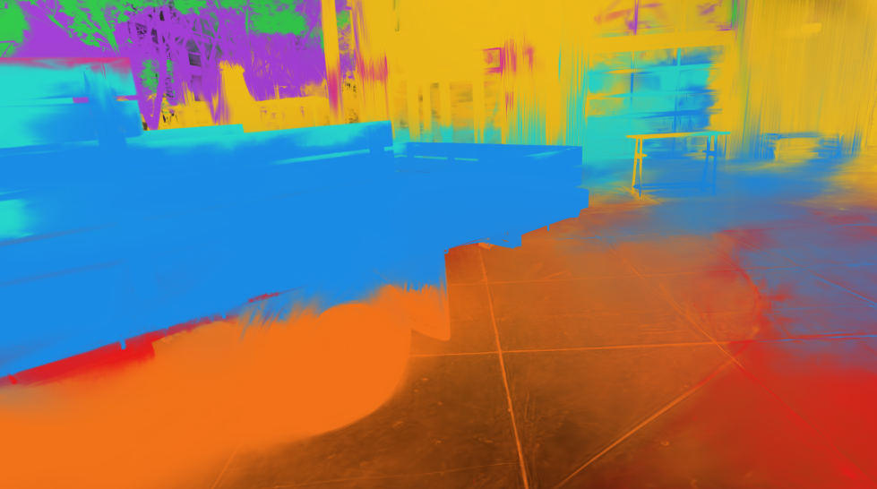 | 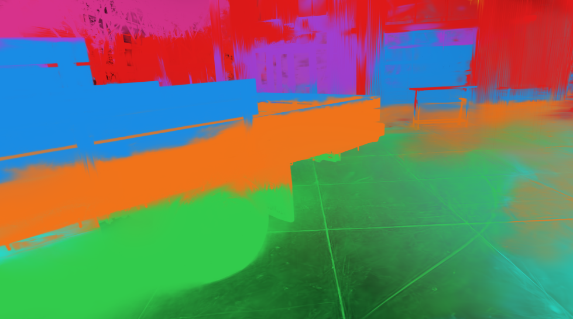 |
| Wheel query highlight | 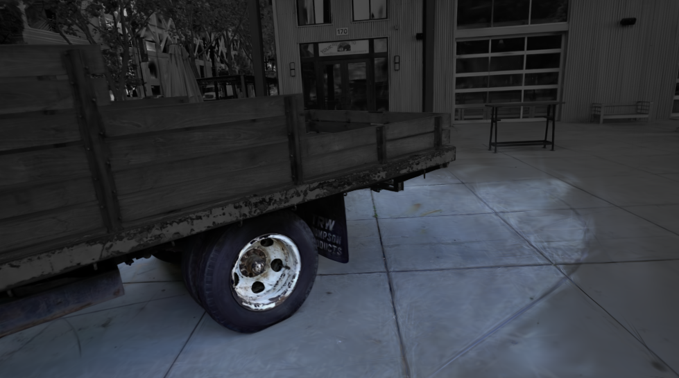 | 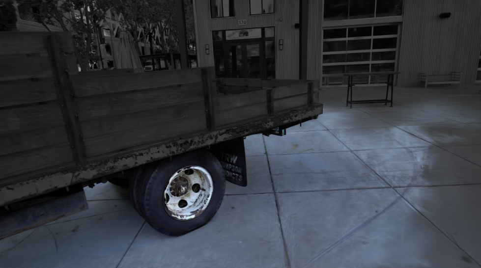 |

### Export

The export path writes real engine-facing assets instead of leaving results as
an experiment-only checkpoint.

```bash
aura export-splat scene.aura --output scene.glb
aura export-usd scene.aura --output scene.usda
aura validate-package scene.aura
aura inspect-package scene.aura
```

Supported export surfaces:

- `KHR_gaussian_splatting` GLB with position, color/opacity, rotation, scale, and
  SH payloads.
- USD ASCII preview bridge for scene-graph and DCC workflows.
- `.aura` package plus `carriers.npz` sidecar for fast local rendering/eval.

## PRISM

PRISM is the **Pluggable Radiance-prImitive Splatting Module**. Its job is to add
typed extension footprints that the primary quality backends do not cover.

| Carrier | Default path | Role |
|---|---|---|
| Gaussian | gsplat | primary quality rasterization |
| Beta | DBS-Beta | primary typed-carrier quality path |
| Gabor | PRISM | additive high-frequency extension |
| Neural | PRISM | additive experimental extension |

PRISM is therefore an extension layer in AURA, not an alternative quality backend
for Gaussian/Beta scenes.

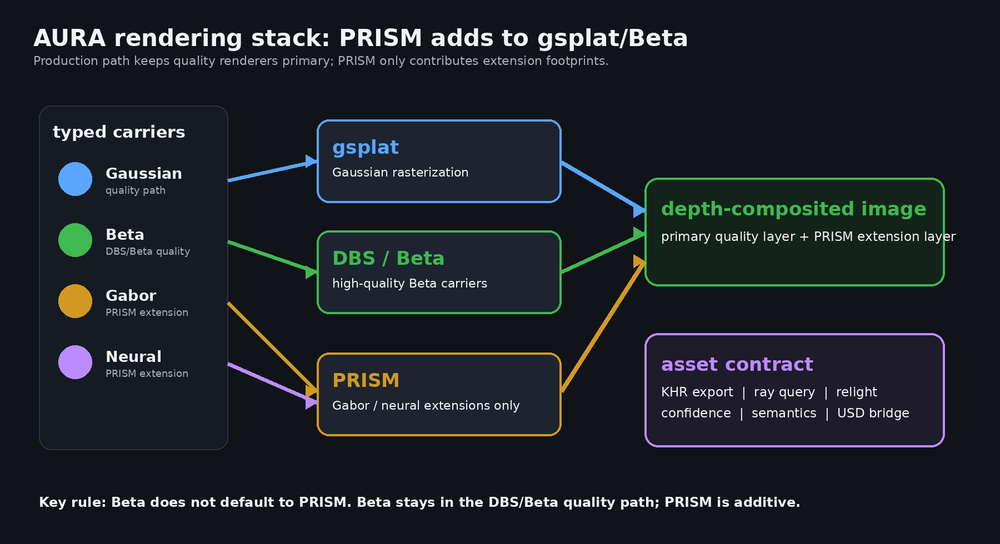

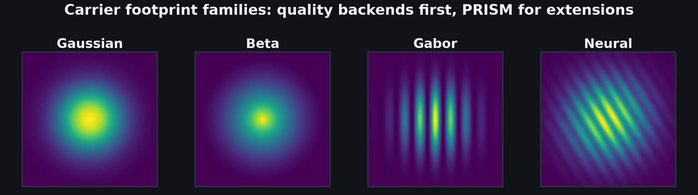

Validation artifact:

```text
experiments/results/prism_additive_validation_2026-06-24.json
```

It verifies that Gaussian/Beta route to the primary backend, Gabor/neural route
to PRISM, and the PRISM extension changes the rendered image.

## External Baselines

The local same-split baseline artifact is complete:

```text
experiments/results/external_baselines_2026-06-24.json
```

| Baseline row | PSNR | SSIM | LPIPS | Boundary |
|---|---:|---:|---:|---|
| COLMAP sparse SfM | 8.9952 | 0.049027 | 0.757455 | local CUDA smoke |
| compact NeRF | 8.6726 | 0.126395 | 0.971559 | local 1-iter CUDA smoke |
| 3DGS / gsplat-control | 26.0172 | 0.890420 | 0.127743 | executed fixed-Gaussian control |
| 2DGS-style surfel | 10.7072 | 0.177134 | 0.645361 | local smoke/protocol row |
| ray-traced-GS-style | 6.7688 | 0.066934 | 0.822136 | local smoke/protocol row |
| official 2DGS full native run | 25.1223 | 0.873086 | 0.173525 | official repo, 30k steps, 32 held-out Truck views |
| official 3DGUT full native run | 25.3198 | 0.878045 | 0.183758 | official repo, 30k steps, 32 validation Truck views |

Official replacement sources are recorded in:

```text
experiments/results/external_baseline_sources_2026-06-24.json
```

The current SOTA A/B artifact is:

```text
experiments/results/sota_ab_validation_2026-06-25.json
sotaReady: false
promotedProviderIds: 3dgrut_3dgut_official, official_2dgs
remaining blocker: DINOv3 semantic diversity parity
```

## Install

```bash
python -m venv .venv
source .venv/bin/activate
pip install --upgrade pip
pip install -e ".[dev,gpu,assets]"
```

For CUDA-first local work, use the existing GPU environments when available:

```bash
source .gpu_venv/bin/activate
```

The DBS-Beta fork installs under the `gsplat` package name and is kept isolated
in `.dbs_venv`.

## Quick Start

```bash
# 1. Build a capture manifest from COLMAP.
aura colmap-to-capture-manifest data/tanks/truck/sparse/0 \
  --root data/tanks/truck \
  --image-dir data/tanks/truck/images \
  --output outputs/truck-manifest.json \
  --point-seeded

# 2. Train or import carriers.
aura train-gsplat outputs/truck-manifest.json --output outputs/truck.aura --scale 1.0

# 3. Use the asset.
aura render outputs/truck.aura --backend torch --output docs/view.ppm
aura export-splat outputs/truck.aura --output docs/truck.glb
aura ray-query outputs/truck.aura --origin 0 0 0 --direction 0 0 1
```

## Reproduce The Evidence

Most headline artifacts are generated from scripts in `experiments/`.

```bash
bash scripts/fetch_scene.sh truck data/tanks/truck
bash experiments/dbs_truck_ablation.sh
bash experiments/dbs_compactness_sweep.sh
bash experiments/run_multiscene.sh 7000 1
python experiments/collect_multiscene.py
python experiments/audit_multiscene.py
python experiments/prism_additive_validation.py
python experiments/prism_benchmark.py
python experiments/secondary_reflection_validation.py
python experiments/inverse_material_validation.py
python experiments/external_baseline_smokes.py --device cuda
python experiments/render_tandt_scene_gifs.py
python experiments/make_readme_visuals.py
```

Regenerate the publication report:

```bash
aura publication-validation-report \
  --output experiments/results/publication_validation_2026-06-24.json
```

## Gallery

| AURA | PRISM / Evidence |
|---|---|
| **Reconstruction**<br> | **Method map**<br> |
| **Depth query**<br> | **PRISM stack**<br> |
| **Relighting**<br> | **PRISM footprints**<br> |
| **Confidence**<br> | **Benchmark scene grid**<br> |
| **Semantics**<br> | **8-scene quality**<br> |
| **Open-vocabulary query**<br> | **Per-scene gains**<br> |

## Repository Map

```text
src/aura/
  carrier_io.py             fast carriers.npz sidecar
  gltf_splat.py             KHR_gaussian_splatting export
  hybrid.py                 primary backend + PRISM extension routing
  prism.py                  torch PRISM rasterizer
  prism_cuda.py             CUDA PRISM path
  publication.py            artifact-backed publication gate report
  readiness.py              stricter production-readiness boundary
  relight.py                relighting layer
  confidence.py             per-carrier confidence
  carrier_query.py          ray-query payloads
  schemas/                  .aura package schemas

scripts/                    dataset, eval, baseline, and DBS bridge utilities
experiments/                reproduction scripts and figure/GIF generators
tests/                      contract, renderer, validation, and CLI tests
docs/                       README figures and GIFs
```

## License

MIT. See [LICENSE](LICENSE).
