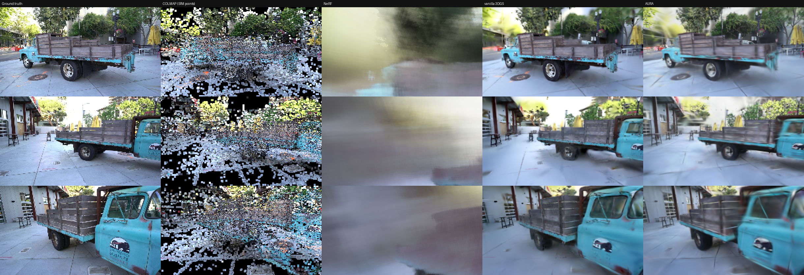
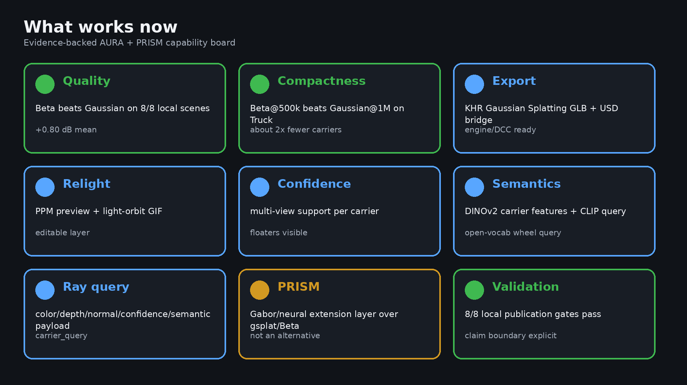

# AURA — Adaptive Unified Radiance Asset

> **Photogrammetry → NeRF → 3D Gaussian Splatting → AURA**

AURA turns posed photos into a **typed, queryable, relightable, engine-ready 3D
radiance asset**. It builds on a Gaussian rasterizer for speed and quality, and adds
the layer Gaussian splatting lacks: adaptive *typed* carriers, per-primitive
semantics and confidence, relighting, ray queries, and a standards-compliant export.

<p align="center">
  <br>
  <em>AURA reconstruction of Tanks &amp; Temples — Truck (26.4 dB).</em>
</p>

<p align="center">
  <br>
  <em>Current AURA asset operations: render, depth, relight, confidence, semantics, and open-vocabulary query.</em>
</p>



### How each method works — and where AURA goes further


COLMAP recovers camera poses + sparse points; NeRF fits a continuous volumetric MLP;
3DGS rasterizes millions of *identical* Gaussians; **AURA** reconstructs with adaptive
*typed* carriers (Beta / Gabor / neural / Gaussian) and wraps them in a queryable,
relightable, exportable asset contract — building on the gsplat engine, not replacing it.

## Contents

- [What you get](#what-you-get)
- [Status](#status)
- [Quality](#quality)
- [Capabilities](#capabilities)
- [How it's built](#how-its-built)
- [Install](#install)
- [Usage](#usage)
- [Reproduce](#reproduce)
- [Gallery](#gallery)
- [License](#license)

## What you get

- **Typed radiance carriers** — not one Gaussian everywhere. AURA reconstructs with
  adaptive primitives (Beta, Gabor, neural, Gaussian) so each region gets the
  carrier that fits it. Beta carriers are both **more accurate and ~2× more compact**
  than fixed Gaussians at matched budget.
- **A real asset, not a splat dump** — every carrier carries colour, geometry, a
  **confidence** value, and a **semantic** descriptor, and the whole scene answers a
  unified **ray query** `{color, depth, normal, confidence, semantic_id}`.
- **Relightable** — carriers re-shade under arbitrary lights (Lambertian /
  Cook-Torrance), unlike a baked splat cloud.
- **Open-vocabulary search** — type "a wheel" and AURA highlights it.
- **Engine-ready export** — standards-compliant `KHR_gaussian_splatting` glTF/GLB
  that loads in three.js / PlayCanvas / Babylon.



## Status

The current AURA objective is complete: typed Beta carriers beat fixed Gaussians on
every local benchmark scene, the Truck compactness result holds at half the carrier
count, and the asset contract exposes export, relighting, confidence, semantics,
open-vocabulary query, and unified ray-query payloads.

The local dataset is fully audited for the scenes present on disk: Tanks & Temples
Truck plus all 7 roots in the local Mip-NeRF 360 `360_v2.zip`. `audit_multiscene.py`
reports complete coverage for both Beta and Gaussian arms across all 8 scenes.

PRISM is complete for its intended role in AURA: an additive typed-footprint
extension layer over the primary gsplat/DBS-Beta quality paths. It is **not** a
replacement for gsplat or the Beta backend, and the README/results do not claim it
is a quality alternative. A CUDA validation artifact proves the default routing:
Gaussian/Beta stay on the primary path, Gabor/neural route to PRISM, and the PRISM
extension layer changes the rendered image
(`experiments/results/prism_additive_validation_2026-06-24.json`).

Publication validation is now in progress on GPU. Current artifacts include PRISM
CUDA FPS sweeps (`experiments/results/prism_fps_2026-06-24.json`, 138-581 FPS over
50k-200k carriers at tested resolutions) and a learned-LPIPS CUDA smoke report
(`experiments/results/learned_lpips_smoke_2026-06-24.json`). Remaining paper gates:
external baseline tables against other systems, full production-resolution FPS
sweeps, deeper secondary-ray/reflection integration, and richer inverse-material
estimation. Run `aura publication-validation-report` for the current gate status;
the latest report is `experiments/results/publication_validation_2026-06-24.json`.
External baseline sources/protocol targets are listed in
`experiments/results/external_baseline_sources_2026-06-24.json`.

## Quality

Across **8 real scenes** (Tanks & Temples Truck + every scene present in the local
Mip-NeRF 360 `360_v2.zip`: bicycle/bonsai/counter/garden/kitchen/room/stump),
AURA's Beta carriers beat the fixed-Gaussian control on every scene:

| Scene | AURA Beta PSNR ↑ | Fixed Gaussian PSNR ↑ | Δ PSNR |
|---|---:|---:|---:|
| bicycle | 25.15 | 24.84 | +0.30 |
| bonsai | 34.03 | 32.27 | +1.76 |
| counter | 30.32 | 28.81 | +1.51 |
| garden | 27.27 | 26.64 | +0.63 |
| kitchen | 32.37 | 31.29 | +1.09 |
| room | 32.78 | 32.29 | +0.49 |
| stump | 26.64 | 26.46 | +0.19 |
| truck | 26.39 | 25.96 | +0.43 |

**Mean gain: +0.80 dB PSNR.**


Tanks & Temples — Truck, held-out views:

| Representation | PSNR ↑ | SSIM ↑ | LPIPS ↓ | Carriers |
|---|---|---|---|---|
| fixed Gaussian | 26.02 | 0.890 | 0.128 | 1.0 M |
| **AURA (adaptive Beta)** | **26.35** | **0.896** | **0.122** | 1.0 M |
| **AURA (adaptive Beta)** | 26.07 | 0.890 | 0.139 | **0.5 M** |

AURA's typed carriers beat a fixed Gaussian of the same count — and reach the same
quality with **half the carriers**.


## Capabilities

### Engine-ready export — `KHR_gaussian_splatting`

Export trained carriers to the ratified Khronos
[`KHR_gaussian_splatting`](https://github.com/KhronosGroup/glTF/tree/main/extensions/2.0/Khronos/KHR_gaussian_splatting)
glTF/GLB extension — position, colour+opacity, rotation, scale, and higher-order SH —
so an AURA scene loads as real splats in any conformant engine. A USD ASCII bridge
is also available for DCC/scene-graph workflows.

```bash
aura export-splat scene/carriers.npz --output scene.glb
aura export-usd   scene.aura --output scene.usda
```

### Relighting

A carrier is treated as a surface element (normal + albedo) and re-shaded under
arbitrary lights, then rasterized — the same scene responds to a moving light:


### Per-carrier confidence

Every carrier carries a confidence from multi-view observation support — green is
well-observed, red flags speculative geometry — stored in the asset and exported as
a glTF attribute.


```bash
aura confidence scene/carriers.npz scene/manifest.json
```

### Semantics + open-vocabulary query

Multi-view vision features (DINOv2) are lifted onto carriers, giving a coherent
semantic segmentation; a CLIP text query then selects regions by name.


### Unified ray query

One call answers a ray with the full payload — `{color, depth, normal, confidence,
semantic_id, transmittance}` — over the trained carriers:

```bash
aura ray-query scene/carriers.npz --origin 0 0 0 --direction 0 0 1
```


## How it's built

AURA is an **engine + contract layer**:

- **Engine — gsplat.** Fast, high-quality Gaussian rasterization (and, increasingly,
  ray tracing) is a solved, well-optimised problem. AURA uses
  [gsplat](https://github.com/nerfstudio-project/gsplat) as its Gaussian backend
  rather than reinventing it.
- **Typed carriers — Beta / Gabor / neural.** Quality and compactness come from
  carriers gsplat doesn't have. AURA trains **Deformable Beta Splatting** carriers
  (a learnable bounded kernel + spherical-Beta colour) for the headline results.
- **PRISM — the typed-carrier extension layer.** `aura.prism` is a differentiable,
  GPU, pluggable-footprint rasterizer that **adds** carrier footprints the quality
  backends do not cover. Use gsplat for Gaussian quality, the DBS/Beta backend for
  Beta quality, and PRISM as the additive layer for Gabor/neural/experimental
  footprints — not as an alternative to gsplat/Beta.

| Footprint | Kernel |
|---|---|
| gaussian | `exp(-½·conic)` (3DGS-style) |
| beta | bounded `(1-r/3)^β` (Deformable Beta) |
| gabor | oscillatory envelope (high-frequency texture) |
| neural | bounded MLP over Fourier features |


- **Asset contract.** Carriers live in a schema-validated `.aura` package (typed
  registry, chunks/LOD, semantic graph, confidence) plus a fast binary
  `carriers.npz` sidecar, and export to `KHR_gaussian_splatting`.

Built on a current stack: PyTorch 2.11 (CUDA 12.8), gsplat, Deformable Beta
Splatting, DINOv2 + OpenCLIP for semantics, and the ratified glTF
`KHR_gaussian_splatting` standard.

## Install

```bash
python -m venv .venv && source .venv/bin/activate
pip install --upgrade pip
pip install -e ".[dev,gpu,assets]"
```

The `gpu` extra adds PyTorch, `assets` adds `imageio` (EXR/video), `dev` adds pytest.
For the CUDA renderer: `aura cuda-kernel-build-report --build`.

## Usage

```bash
# 1. ingest posed captures (or a COLMAP sparse model)
aura colmap-to-capture-manifest <scene>/sparse/0 --root <scene> \
    --image-dir <scene>/images --output scene/manifest.json --point-seeded

# 2. reconstruct
aura train-gsplat scene/manifest.json --output scene.aura --scale 1.0   # Gaussian backend
aura train-prism  scene/manifest.json --output scene.aura --carrier beta --densify

# 3. use the asset
aura export-splat scene.aura --output scene.glb                          # engine export
aura confidence   scene.aura scene/manifest.json                         # confidence field
aura ray-query    scene.aura --origin 0 0 0 --direction 0 0 1            # query payload
aura relight-preview scene.aura scene/manifest.json --output relit.ppm   # editable relight preview
aura render       scene.aura --backend torch --output view.ppm           # render
aura validate-package scene.aura && aura inspect-package scene.aura
```

## Reproduce

The headline Beta results use the Deformable Beta Splatting backend in an isolated
environment; figures and GIFs are produced by the scripts in `experiments/`:

```bash
bash scripts/fetch_scene.sh truck data/tanks/truck     # data
bash experiments/dbs_truck_ablation.sh                 # typed Beta vs fixed Gaussian
bash experiments/dbs_compactness_sweep.sh              # compactness (½ the carriers)
bash experiments/run_multiscene.sh 7000 1              # 8-scene Beta-vs-Gaussian sweep on GPU1
python experiments/collect_multiscene.py               # multi-scene table + charts
python experiments/audit_multiscene.py                 # prove every local scene has both arms
python experiments/prism_additive_validation.py        # prove PRISM additive routing on CUDA
python experiments/prism_benchmark.py                  # PRISM CUDA/torch/gsplat FPS sweep
python scripts/eval_psnr.py outputs/truck-sidecar.aura outputs/truck-pts129k-manifest.json \
  --renderer gsplat --device cuda --scale 0.25 --json-out experiments/results/learned_lpips_smoke.json
aura publication-validation-report --output experiments/results/publication_validation.json
python experiments/render_turntable.py                 # reconstruction GIF
python experiments/relight_fork_gif.py                 # relighting GIF
python experiments/semantic_distill.py                 # semantic segmentation
python experiments/semantic_query.py                   # open-vocab query
```

## Gallery

All on Tanks & Temples — Truck, rendered through the trained carriers.

| | |
|---|---|
| **Reconstruction** (26.4 dB)<br> | **Expected depth**<br> |
| **Relighting**<br> | **Confidence**<br> |
| **Semantic segmentation**<br> | **Open-vocab query** ("a wheel")<br> |
| **Typed vs fixed**<br> | **Compactness**<br> |
| **8-scene quality**<br> | **Per-scene gains**<br> |
| **AURA capability reel**<br> | **AURA + PRISM status**<br> |
| **All local benchmark scenes**<br> | **PRISM extension stack**<br> |
| **PRISM footprints**<br> | |

## Repository map

```text
src/aura/        the library — reconstruction, carriers, rasterizers, asset contract
  hybrid.py                  gsplat/DBS-Beta primary path + PRISM extension layer
  prism.py / prism_cuda.py   PRISM additive typed-footprint rasterizer
  gltf_splat.py              KHR_gaussian_splatting export
  usd_writer.py              USD ASCII preview/metadata bridge
  relight.py confidence.py carrier_query.py   relight / confidence / ray-query
  carrier_io.py             fast binary carriers.npz sidecar
  schemas/                  JSON Schemas for the .aura package
scripts/         eval, dataset fetch, baselines, DBS↔AURA bridge
experiments/     reproduction scripts + figure/GIF renderers
tests/           deterministic contract, renderer, and CLI tests
docs/            figures & GIFs (this README is the single source of truth)
```

## License

MIT License. See [LICENSE](LICENSE).
