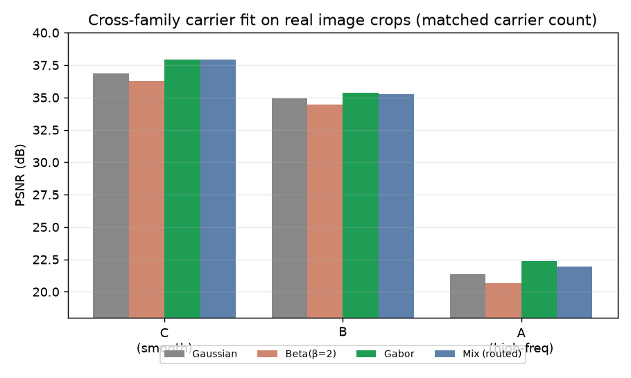

# AURA — Adaptive Unified Radiance Asset

> **Photogrammetry → NeRF → 3D Gaussian Splatting → AURA**

A **post-3DGS** reconstruction engine. Instead of one primitive type everywhere,
AURA reconstructs a scene as adaptive **_typed_ radiance carriers** and wraps them
in a single **queryable · relightable · standards-exportable** asset contract —
the things a raw 3DGS splat cloud can't do.

<p align="center">
  <br>
  <em>AURA reconstruction of Tanks &amp; Temples — Truck (26.4 dB, adaptive Beta carriers).</em>
</p>

The lineage AURA extends, all rendered through the **same correct COLMAP poses**:


_Ground truth · COLMAP SfM point cloud · NeRF (compact, from scratch) · vanilla
3DGS · AURA. See [Architecture](#architecture) for the full design and
[Gallery](#gallery) for all figures & GIFs._

## Contents

- [Results: typed carriers beat fixed Gaussians](#results-typed-carriers-beat-fixed-gaussians)
- [Capabilities (what a raw 3DGS cloud can't do)](#capabilities)
- [Speed](#speed)
- [Status: proven vs open](#status-proven-vs-open)
- [Architecture](#architecture)
- [What's inside](#whats-inside)
- [Install](#install)
- [Reproduce](#reproduce)
- [Quickstart & usage](#quickstart--usage)
- [Repository map](#repository-map)
- [Gallery](#gallery)
- [License](#license)

## Results: typed carriers beat fixed Gaussians

The point of a post-3DGS engine is that **adaptive typed carriers reconstruct
better than one fixed primitive**. AURA proves this with a controlled experiment
(`experiments/dbs_truck_ablation.sh`) using **Deformable Beta Splatting** carriers
— same harness, data, `llffhold=8` eval, MCMC densification, and **1,000,000
carriers per arm** — varying only the carrier's type degrees of freedom:

| Carrier type | kernel + colour | PSNR ↑ | SSIM ↑ | LPIPS ↓ |
|---|---|---|---|---|
| fixed (Gaussian-style) | frozen kernel + SH colour | 26.017 | 0.8904 | 0.1277 |
| **adaptive Beta** | deformable Beta kernel + spherical-Beta colour | **26.352** | **0.8964** | **0.1219** |

**+0.335 dB / +0.0060 SSIM / −0.0058 LPIPS** for the Beta carrier over a
Gaussian-style one, at matched carrier count.


_Held-out test view, with a zoom crop. Top: full frame; bottom: detail crop._

**Where the win actually comes from (honest decomposition).** A controlled β sweep
(`experiments/dbs_routing_sweep.sh`, frozen uniform β ∈ {2,6,16,50} with
spherical-Beta colour held on) decomposes the +0.335 dB:

| arm (sb colour on) | PSNR | SSIM | LPIPS |
|---|---|---|---|
| learned-β (adaptive per-region) | 26.352 | 0.8964 | 0.1219 |
| uniform β=2 | 26.421 | 0.8961 | 0.1229 |
| uniform β=6 | 26.404 | 0.8965 | 0.1220 |
| uniform β=16 | 26.411 | 0.8963 | 0.1224 |
| uniform β=50 (≈Gaussian) | 26.314 | 0.8945 | 0.1266 |

- The **spherical-Beta colour model** carries most of the win (~+0.4 dB: the
  fixed-Gaussian arm above used SH colour at 26.017; matched-β with sb colour is
  ~26.4).
- The **Beta kernel shape** adds a smaller ~+0.09 dB (β≈6 vs near-Gaussian β=50).
- **Adaptive per-region β routing does *not* beat the best single global β** — the
  learned-β arm (26.352) sits *below* uniform β=2/6/16. A clean negative result:
  within one kernel family, picking a good global shape is as good as learning it
  per carrier. The open novel question is routing between *distinct families*
  (Beta vs Gabor), not β within Beta.

**…and it's more compact** (`experiments/dbs_compactness_sweep.sh`, Beta vs
fixed-Gaussian at matched `cap_max`):

| carriers | Beta | fixed-Gaussian |
|---|---|---|
| 250k | 25.57 | 25.16 |
| 500k | **26.07** | 25.78 |
| 1M | 26.35 | 26.02 |

**Beta@500k (26.07 dB) beats Gaussian@1M (26.02 dB)** — equal quality at *half* the
carriers.


The Beta backend runs in an isolated venv (`.dbs_venv`); `scripts/dbs_bridge.py`
converts its output into AURA's `carriers.npz`.

**Does per-region *routing* between carrier families help?** Tested
(`experiments/prism_crossfamily.py`): the more-expressive **Gabor** footprint beats
Gaussian on every crop, but **mix-routing never beats the best single family** —
so per-region routing is *not* the lever; an expressive carrier *type* is. An honest
negative that focuses the thesis.



<details>
<summary><strong>Footnote: the pose fix that unblocked all of this (+6.6 dB)</strong></summary>

Early runs plateaued at ~14–16 dB. The cause was **not** the representation — the
COLMAP→manifest conversion stored only `camera_origin` + `look_at` and rebuilt the
view from a fixed `up=(0,-1,0)`, **dropping camera roll**. Carrying the full
world-to-camera rotation (`view_rotation`) gave **+6.6 dB from poses alone**
(`experiments/direct_pose_test.py`); the comparison figures above all use the
corrected poses. The gsplat backend then reaches 18–19 dB at reduced scale; the
Beta backend reaches the 26 dB numbers above at full DBS settings.

</details>

## Capabilities

_What a raw 3DGS cloud can't do._

These work over the **real trained carriers** (`carriers.npz`), not a toy scene,
and are what make AURA an *asset contract* rather than a splat dump.

### Standards-compliant asset export (`KHR_gaussian_splatting`)

AURA exports trained carriers to the ratified Khronos
[`KHR_gaussian_splatting`](https://github.com/KhronosGroup/glTF/tree/main/extensions/2.0/Khronos/KHR_gaussian_splatting)
glTF/GLB extension (POSITION, COLOR_0 rgba, ROTATION, SCALE, OPACITY, higher-order
SH), so assets load as real splats in conformant engines (three.js / PlayCanvas /
Babylon) — not a degenerate point cloud. Validated end to end: DBS-train → 1M Beta
carriers → `carriers.npz` → a 52 MB engine-loadable GLB.

```bash
aura export-splat path/to/package_or_carriers.npz --output scene.glb
```

### Relightable carriers (a capability vanilla 3DGS lacks)

3DGS bakes lighting into view-dependent colour and cannot be relit. AURA treats a
carrier as a surface element — **normal** = the Gaussian's short axis, **albedo** =
the diffuse colour — and applies `shading.py`'s Lambertian / Cook-Torrance BRDFs to
produce a *relit* colour under arbitrary lights, then rasterizes
(`aura.relight.render_relit`, 5 tests). A directional light orbiting the scene,
rendered sharply through the Beta rasterizer (`experiments/relight_fork_gif.py`):


Honest scope: covariance normals are unsigned/noisy, so this is an editable
relighting *layer*, not a full inverse-rendering material decomposition.

### Per-carrier confidence

Every carrier gets a **confidence** in `[0,1]` from *multi-view observation
support* — how many posed views actually see it (`aura.confidence`,
`multiview_confidence`). Speculative floaters seen by few views score low; the
field is stored in `carriers.npz` and exported as the `_AURA_CONFIDENCE` glTF
attribute. No mainstream 3DGS pipeline exposes a per-primitive confidence.


_Carriers coloured by confidence: green = well-observed, red = speculative._

### Semantics + open-vocabulary query

The contract reserves a per-carrier `semantic_id` / feature (the ray query returns
it). AURA fills it by **multi-view DINOv2 feature lifting**: each carrier is
projected into many training views, dense DINOv2 patch features are sampled and
aggregated per carrier (`experiments/semantic_distill.py`). Clustering the result
gives a coherent segmentation that respects object boundaries — truck bed, cab,
wheel, ground, and background separate:


On top of that, **open-vocabulary text query** (`experiments/semantic_query.py`):
each group is CLIP-image-embedded and matched against the CLIP text embedding of a
query. Typing **"a wheel"** highlights the wheel; "a truck" / "the ground" /
"a building" each select their distinct region:


### Unified ray query

One call answers a ray over the trained carriers with the full contract payload —
`rayQuery(r) → {color, depth, normal, confidence, semantic_id, transmittance}`
(`aura.carrier_query`, front-to-back opacity accumulation; the confidence field
doubles as a floater filter). The same payload geometry powers depth/normal
readout:

<p align="center">
  <br>
  <em>Expected-depth render (near = dark, far = light) — the geometry the ray query reads.</em>
</p>

## Speed

_PRISM forward rasterizer, RTX 5090, ms/frame · FPS._

AURA also ships **PRISM** (`aura.prism` / `aura.prism_cuda`) — its *own* pluggable
differentiable rasterizer that splats gaussian/beta/gabor/neural footprints (an
alternative to gsplat, kept as a real-time research substrate). Its CUDA kernel is
real-time, ~18–25× its own torch tiled path; gsplat (mature, fused) is faster still.

| Carriers | Res | PRISM CUDA | PRISM torch | gsplat |
|---|---|---|---|---|
| 50k | 512² | 1.68 ms / 595 fps | 35.9 ms | 0.23 ms |
| 100k | 512² | 1.99 ms / 503 fps | 36.4 ms | 0.29 ms |
| 200k | 979×546 | 7.23 ms / 138 fps | 54.5 ms | 1.26 ms |

PRISM trains all four footprints (gaussian/beta/gabor/neural):

| Footprint | Kernel | Backend |
|---|---|---|
| **gaussian** | `exp(-½·conic)` (3DGS-style) | CUDA fwd + diff. backward |
| **beta** | bounded `(1-r/3)^β` (Deformable-Beta) | CUDA fwd + diff. backward |
| **gabor** | envelope × oscillation (high-freq texture) | CUDA fwd + diff. backward |
| **neural** | bounded MLP over Fourier features (Splat-the-Net) | torch (autograd) |

## Status: proven vs open

- ✅ **Typed beats fixed**, on real data, controlled: adaptive Beta +0.335 dB over a
  Gaussian-style carrier at matched budget. The win is mostly the spherical-Beta
  **colour** (~+0.4 dB) and partly the kernel **shape** (~+0.09 dB).
- ✅ **Asset contract over real carriers**: KHR export, relighting, per-carrier
  confidence, and a unified ray query — all tested.
- 🔬 **Resolved finding — routing is not the lever.** Two controlled experiments
  (per-region β within Beta; cross-family Beta vs Gabor) both show mix-routing does
  *not* beat using the best single carrier type everywhere. This isn't a gap to
  close — it's a settled negative that retired the "adaptive mixed-routing"
  hypothesis and refocused AURA on expressive carrier *types* + the asset contract.
- ✅ **Semantics via feature lifting + open-vocab query.** Multi-view DINOv2
  features are aggregated per carrier (coherent segmentation), and a text query
  ("a wheel") highlights the matching group via CLIP — no manual labels.
- ⚖️ **Quality engine is gsplat + Beta by design; PRISM is the research substrate.**
  PRISM (AURA's own rasterizer) was pushed hard: 3DGS-style opacity reset +
  position-LR decay (fixed its training *divergence*) and clone**+split**
  densification (carriers now *grow* 80k→144k instead of collapsing). Quality went
  10.48 → 12.04 (3k) → **12.62 dB** (7k, clone+split; `experiments/prism_maxpush.py`)
  — stable and improving, but still ~6 dB below the gsplat backend (~18-19 @0.25).
  Closing that last gap is genuine fused-rasterizer R&D (gsplat is a mature, tuned
  CUDA library); the right engineering call is what AURA already does — **use
  gsplat+Beta for quality (26 dB) and keep PRISM as the typed-footprint substrate**,
  not chase parity. This is a resolved design decision, not an open gap.

Reproduce: `experiments/dbs_truck_ablation.sh`, `experiments/dbs_routing_sweep.sh`,
`experiments/render_gifs.py`, `experiments/direct_pose_test.py`.

## Architecture

A single primitive type is insufficient for every region of a scene. AURA trains a
**mixed adaptive carrier** representation where each spatial region is assigned the
most appropriate primitive type based on measured evidence, and wraps the result in
a queryable/editable asset.

### Carrier families

| Carrier | Best for |
|---|---|
| Surface radiance cell | Stable opaque geometry, normals, collision, edit handles |
| Volumetric density cell | Translucent, fuzzy, or uncertain regions |
| Bounded beta kernel | Compact local support, fewer primitive hits per ray |
| Gabor / frequency carrier | High-frequency texture and alias control |
| Neural residual primitive | View-dependent effects simpler carriers can't explain |
| Semantic / object carrier | Object grouping, language anchors, per-object confidence/LOD |
| Gaussian fallback | Regions where structured evidence doesn't justify a stronger primitive |

A Gaussian fallback is explicitly labelled; when evidence justifies a surface /
volume / beta / gabor / neural / semantic carrier, those native types dominate, so
the representation stays **auditable**.

### Reconstruction pipeline

```text
posed images / depth / masks / normals
  → capture manifest (JSON)
  → packed capture tensors (PNG / PPM / COLMAP dense / imageio EXR)
  → tiled PyTorch optimization (device-resident batching, mask-aware sampling,
      ray construction, carrier response, front-to-back compositing, multi-loss)
  → adaptive carrier evolution (split / promote / merge / demote, with hysteresis)
  → optimized .aura package (ray-query, confidence, edit metadata, semantic graph,
      JSON schemas, chunk/LOD layers) + fast carriers.npz sidecar
```

Carrier evolution is a **deterministic policy contract**: each iteration records one
decision (split/promote/merge/demote/retain) + reason + element IDs per element, so
runs are auditable. A compiled CUDA renderer (`aura cuda-kernel-build-report
--build`) dispatches `render_rays` over packed tensors with a production BVH
traversal kernel (`render_rays_bvh`), at measured parity with the torch renderer.

### `.aura` package format

A directory: `manifest.json` (metadata + schema version), `elements.json` (typed
carrier registry), `chunks.json` (LOD/decomposition), `exchange.json` (ingest +
decomposition audit), `semantic_graph.json`, `capture_manifest.json`,
`training_dataset.json` — all JSON-schema-validated (`src/aura/schemas/`) on load —
plus the binary `carriers.npz` tensor sidecar for fast render/eval. 3DGS exports
ingest via `aura import-3dgs` as `EvidenceSample` records (Gaussian fallback only);
all 3DGS-specific logic stays under `aura.ingest`.

### Prior art

[COLMAP](https://demuc.de/colmap/) (calibration/SfM/MVS) → [NeRF](https://arxiv.org/abs/2003.08934)
(continuous field) → [3DGS](https://arxiv.org/abs/2308.04079) (explicit real-time
splats). Single-axis successors patch individual 3DGS weaknesses —
[2DGS](https://arxiv.org/abs/2403.17888), [SuGaR](https://arxiv.org/abs/2311.12775),
[GOF](https://arxiv.org/abs/2404.10772), [Mip-Splatting](https://niujinshuchong.github.io/mip-splatting/),
[StopThePop](https://arxiv.org/abs/2402.00525), [3DGRT](https://arxiv.org/abs/2407.07090),
[EVER](https://arxiv.org/abs/2410.01804), and Deformable Beta Splatting. AURA's
thesis is the typed-carrier *asset contract* over the best of these.

## What's inside

- **Carrier registry & `.aura` format** — typed carriers (surface/volume/beta/
  gabor/neural/semantic/Gaussian) with schema-validated payloads; fast binary
  `carriers.npz` sidecar (`aura.carrier_io`).
- **Reconstruction** — capture-manifest ingest (COLMAP import), tiled torch
  optimisation (`aura train`), the gsplat backend (`aura train-gsplat`), PRISM
  (`aura train-prism`), and the DBS Beta bridge (`scripts/dbs_bridge.py`).
- **Asset contract** — KHR_gaussian_splatting export (`aura export-splat`),
  relighting (`aura.relight`), confidence (`aura.confidence`), unified ray query
  (`aura.carrier_query`), shading (Lambertian + Cook-Torrance + IBL), CUDA/BVH
  ray traversal, EXR/PFM + turntable export.
- **Eval** — GPU PSNR/SSIM, real-scene benchmark harness, memory-stability probe.

<details>
<summary>Full capability list</summary>


- Native carrier registry for surface, volume, beta, gabor, neural residual,
  semantic, and Gaussian fallback carriers with typed payload validation.
- `.aura` package writer, loader, and runtime JSON Schema validator covering
  manifest, elements, chunks, exchange, semantic graph, and training records.
- Capture manifest format for posed image / depth / mask / normal assets with
  COLMAP sparse-model import (`aura colmap-to-capture-manifest`).
- Packed capture tensor loading for PNG, PPM/PGM, COLMAP dense maps, and
  optional `imageio` EXR/HDR/video backends.
- Tiled PyTorch optimization (`aura train`) with device-resident asset batching,
  mask-aware pixel sampling, camera ray construction, configurable loss weights,
  gradient clipping, and checkpoint/resume support.
- Grouped torch ray/carrier intersections for all carrier types with ordered
  front-to-back compositing across color, alpha, depth, normal, confidence,
  material, semantics, residual, and hit outputs.
- Compiled CUDA renderer dispatched via pybind11 `render_rays` over packed
  scene and ray tensors, with measured per-carrier parity against the PyTorch
  renderer.
- Production GPU BVH traversal kernel (`render_rays_bvh`) using a flattened
  binned-SAH element BVH (median-split fallback), replacing the brute-force scan.
- Anti-aliasing for the torch renderer: Mip-Splatting-style 3D frequency cap,
  ray-cone footprint prefilter, and 2x2 supersampling (all opt-in), plus
  early-transmittance termination for energy-conserving compositing.
- Per-attribute Adam optimization with per-group learning-rate schedules,
  alongside the existing SGD path; gradient-magnitude (AbsGS) accumulation,
  opacity reset/recovery signals, importance scores (RadSplat), carrier budget
  ceilings, and optional depth-distortion / normal-consistency losses (2DGS).
- SOTA carrier upgrades (opt-in, defaults preserve prior behavior): deformable
  Beta kernels, multi-directional Gabor filter banks, Scaffold-GS-style anchored
  neural-residual carriers, and LangSplat-style sparse-codebook semantic
  features.
- Semantic-graph-governed heterogeneous carrier allocation (`aura.allocation`):
  scene-graph clustering selects the carrier type per region, with soft
  inter-type conversion scores, cross-carrier residual hooks, and a
  single-carrier ablation mode for typed-mix-vs-baseline studies.
- Physically based shading and relighting (`aura.shading`): Lambertian,
  Cook-Torrance microfacet with split-sum IBL, and BVH shadow-ray visibility
  baking, with per-carrier albedo/roughness/metallic and a relighting demo path
  (emissive output unchanged when shading is disabled).
- CUDA-vs-torch runtime benchmark (`aura benchmark-cuda-runtime`) measuring
  on-device throughput and cross-backend parity.
- EXR/PFM float radiance export and turntable video export (MP4 via
  `imageio[ffmpeg]` or system `ffmpeg`, with PNG frame-sequence fallback).
- Long-run memory stability probe tracking tracemalloc and torch CUDA
  allocations across many iterations.
- Real-scene benchmark harness scoring an `.aura` package against external
  COLMAP/NeRF/3DGS baseline renders (PSNR/SSIM/LPIPS-proxy JSON report).

</details>

All capabilities above are implemented and covered by the deterministic test
suite (advanced optimization / anti-aliasing / allocation / shading paths are
opt-in so default behaviour is unchanged). The real-scene quality numbers in this
README come from the DBS Beta backend; reproduce them with the scripts under
`experiments/`.

## Requirements

- Python 3.11+
- PyTorch 2.3+ (for GPU training and the torch renderer)
- CUDA toolkit (for the compiled CUDA renderer; optional)
- `imageio[assets]` (for EXR export and video; optional)

## Install

```bash
python -m venv .venv
source .venv/bin/activate
pip install --upgrade pip
pip install -e ".[dev,gpu,assets]"
```

The `gpu` extra adds PyTorch. The `assets` extra adds `imageio` for EXR and
video support. The `dev` extra adds pytest.

### CUDA Renderer

After installing on a GPU machine:

```bash
export CUDA_VISIBLE_DEVICES=0
aura torch-renderer-status
aura cuda-kernel-build-report --build
```

`cuda-kernel-build-report` compiles and loads the pybind11 extension and
reports `compiled: true, loadable: true` when the CUDA renderer is available.

## Reproduce

**Headline results** use the Deformable Beta Splatting backend in an isolated venv
(it installs under the `gsplat` name, so it must not share AURA's env):

```bash
# 1. data: Tanks & Temples Truck COLMAP model at data/tanks/truck/{images,sparse/0}
bash scripts/fetch_scene.sh truck data/tanks/truck

# 2. isolated DBS venv (one-time): clone github.com/RongLiu-Leo/beta-splatting to /tmp/dbs,
#    then build its fork on your GPU arch (sm_120 shown)
uv venv --python 3.11 .dbs_venv && source .dbs_venv/bin/activate
uv pip install torch torchvision --index-url https://download.pytorch.org/whl/cu128
uv pip install plyfile tqdm opencv-python-headless scipy matplotlib scikit-learn nerfview splines viser
TORCH_CUDA_ARCH_LIST=12.0 python /tmp/dbs/submodules/setup.py develop      # the Beta gsplat fork

# 3. experiments (write metrics.json per arm)
bash experiments/dbs_truck_ablation.sh        # typed Beta vs fixed Gaussian  → +0.335 dB
bash experiments/dbs_compactness_sweep.sh     # Beta vs Gaussian @ 250k/500k/1M → compactness
bash experiments/dbs_routing_sweep.sh         # β-routing sweep → routing is not the lever
python experiments/prism_crossfamily.py       # cross-family (Gabor vs Gaussian) on real crops

# 4. figures & GIFs (docs/*.png, docs/*.gif)
python experiments/render_turntable.py        # smooth reconstruction orbit GIF
python experiments/relight_fork_gif.py        # relight sweep GIF
python experiments/confidence_viz.py          # confidence heatmap
python experiments/semantic_viz.py            # semantic grouping
```

**Asset contract** (main AURA env — `carriers.npz` from `scripts/dbs_bridge.py convert`):

```bash
aura export-splat path/to/carriers.npz --output scene.glb              # KHR_gaussian_splatting
aura confidence  path/to/carriers.npz manifest.json                    # writes _confidence field
aura ray-query   path/to/carriers.npz --origin 0 0 0 --direction 0 0 1 # full payload as JSON
```

Runs are deterministic (carrier seeding from the COLMAP model; fixed iteration order;
no random eval sampling).

## Quickstart & usage

### 1. Verify the installation

```bash
python -m pytest -q
aura build-native-demo --output-dir outputs/native-demo.aura
aura render outputs/native-demo.aura --backend torch --output outputs/native-demo.ppm
aura benchmark-ray-query outputs/native-demo.aura --native-demo-expectations
```

### 2. Create a capture manifest

```bash
aura write-capture-manifest-template --output outputs/capture-manifest.json
```

Edit the template to reference your posed images, depth maps, masks, and
normals. Or import from a COLMAP sparse model:

```bash
aura colmap-to-capture-manifest data/custom-captures/<scene>/colmap \
  --root data/custom-captures/<scene> \
  --output outputs/capture-from-colmap.json
```

### 3. Inspect and plan sampling

```bash
aura inspect-capture-tensors data/custom-captures/<scene>/capture-manifest.json
aura plan-capture-sampling data/custom-captures/<scene>/capture-manifest.json \
  --tile-size 256 --pixel-stride 8 --max-targets-per-frame 4096
```

### 4. Train

```bash
aura train data/custom-captures/<scene>/capture-manifest.json \
  --device cuda \
  --output outputs/scene.aura \
  --iterations 8 \
  --tile-size 256 \
  --pixel-stride 8 \
  --max-targets-per-frame 4096 \
  --max-targets-per-batch 1024 \
  --image-loss-weight 1.0 \
  --depth-loss-weight 1.0 \
  --query-loss-weight 1.0 \
  --normal-loss-weight 1.0 \
  --mask-loss-weight 1.0 \
  --confidence-loss-weight 1.0 \
  --checkpoint-interval 2
```

Training writes `training_report.json`, optional checkpoint packages, and the
optimized `.aura` package under the selected output directory.

### 5. Resume from a checkpoint

```bash
aura train data/custom-captures/<scene>/capture-manifest.json \
  --device cuda \
  --output outputs/scene-resumed.aura \
  --resume-from outputs/scene.aura/checkpoints/iter_000001.aura
```

## Rendering and Querying

```bash
# Validate and inspect a package
aura validate-package outputs/scene.aura
aura inspect-package outputs/scene.aura

# Render (PPM, EXR, or PFM)
aura render outputs/scene.aura --backend torch --device cuda \
  --output outputs/scene.ppm --width 256 --height 256
aura render outputs/scene.aura --format exr \
  --output outputs/scene.exr --width 256 --height 256

# Turntable video
aura render-video outputs/scene.aura --output outputs/turntable.mp4 \
  --frames 48 --fps 24

# Benchmarks
aura benchmark-reference outputs/scene.aura --width 64 --height 64
aura benchmark-visual outputs/scene.aura outputs/reference.ppm --min-psnr 30
aura benchmark-real-scene outputs/scene.aura \
  --reference-dir data/baselines/<scene> --baseline-label 3dgs --min-psnr 25

# Memory stability
aura memory-stability-probe outputs/scene.aura --iterations 256
```

EXR export requires `imageio[assets]`; without it `--format exr` writes a
stdlib `.pfm` float raster instead. `aura render-video` writes MP4 when an
encoder is available, otherwise a PNG/PPM frame sequence plus a
`sequence.json` manifest.

## Fixture Smoke Tests

These commands exercise small deterministic fixtures without requiring external
datasets:

```bash
aura build-native-demo --output-dir outputs/native-demo.aura
aura render outputs/native-demo.aura --backend torch --output outputs/native-demo.ppm
aura benchmark-ray-query outputs/native-demo.aura --native-demo-expectations
aura write-training-frames-demo --output outputs/training-frames.json
aura reconstruct-demo \
  --frames outputs/training-frames.json \
  --output-dir outputs/reconstruct-demo.aura \
  --iterations 6 \
  --render-backend torch
python -m pytest
```

## Repository Map

```text
src/aura/
  cli.py               CLI — train, render, ingest-adapters, benchmark, inspect commands
  core.py              Reconstruction contracts and adaptive evolution policy
  torch_renderer.py    Torch render batches, grouped carrier hits, compositing
  torch_optimizer.py   Tiled capture optimization and checkpoint snapshots
  torch_kernels.py     Carrier parameter tensors and differentiable responses
  cuda_renderer.py     CUDA renderer ABI and dispatch boundary
  cuda/                CUDA kernels and pybind11 extension sources
  ingest/              Capture, COLMAP, 3DGS, depth, and semantic adapters
  package.py           .aura package IO and validation
  scene.py             Ray-query traversal and response assembly
  carrier_io.py        Binary carriers.npz sidecar (means/scales/quats/opacity/SH/beta/sb/confidence)
  gltf_splat.py        KHR_gaussian_splatting glTF/GLB export
  relight.py           Per-carrier relighting (normals + albedo + shading)
  confidence.py        Multi-view per-carrier confidence
  carrier_query.py     Unified rayQuery over trained carriers
  prism.py / prism_cuda.py   PRISM differentiable rasterizer (gaussian/beta/gabor/neural)
  schemas/             JSON Schema files for runtime validation
tests/                 Deterministic contract, optimizer, renderer, CLI tests
scripts/               eval, dataset fetch, baselines, DBS<->AURA bridge
experiments/           reproduction scripts for every headline result + figure/GIF renderers
docs/                  figures & GIFs embedded above (this README is the single source of truth)
```

`src/aura/ingest/` is an adapter boundary. 3DGS exports become `EvidenceSample`
records and survive only as Gaussian fallback carriers when native carrier
assignment does not justify a stronger representation. All 3DGS-specific logic
stays under `aura.ingest`.

## Data Layout

Keep datasets, checkpoints, renders, and third-party baselines out of git:

```text
data/
  custom-captures/<scene>/
    capture-manifest.json
    images/
    depth/
    masks/
    normals/
    colmap/
third_party/
  gaussian-splatting/
  gsplat/
  nerfstudio/
outputs/          (generated packages, renders, and reports — git-ignored)
```

Baseline datasets (Mip-NeRF 360, Tanks and Temples, Deep Blending, and 3DGS /
nerfstudio exports) are obtained from their original sources and kept under the
git-ignored `data/` and `third_party/` directories. Score a trained package
against external baseline renders with `aura benchmark-real-scene`.

## Development

```bash
pip install -e ".[dev]"
python -m pytest -q
```

- Keep generated `.aura` packages, datasets, checkpoints, renders, and secrets
  out of git (all covered by `.gitignore`).
- All 3DGS-specific logic must remain under `aura.ingest`; splats are evidence
  inputs, not native representation elements.
- New ingest sources must produce `EvidenceSample` records before
  decomposition.

## Gallery

All on Tanks & Temples — **Truck**, rendered through the trained carriers
(scripts in `experiments/`).

| | |
|---|---|
| **Reconstruction** (26.4 dB Beta)<br> | **Expected depth** (ray-query geometry)<br> |
| **Relighting** (light orbit)<br> | **Confidence** (green=trusted, red=floaters)<br> |
| **Distilled semantics** (DINOv2 lifting)<br> | **Open-vocab query** ("a wheel")<br> |
| **Typed vs fixed** (GT·Gaussian·Beta)<br> | **Lineage** (GT·COLMAP·NeRF·3DGS·AURA)<br> |
| **Compactness** (½ the carriers)<br> | **Cross-family fit** (routing ≠ lever)<br> |

The full lineage figure (GT · COLMAP · NeRF · 3DGS · AURA) is at the
[top](#aura--adaptive-unified-radiance-asset).

## License

MIT License. See [LICENSE](LICENSE) for details.
