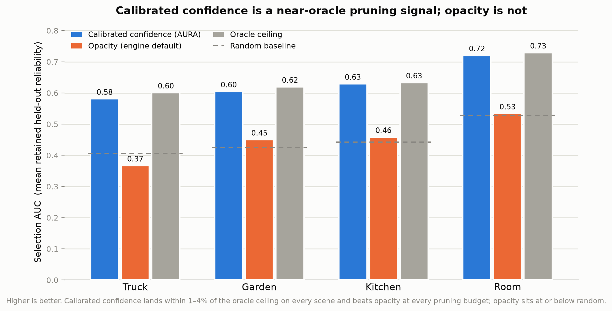
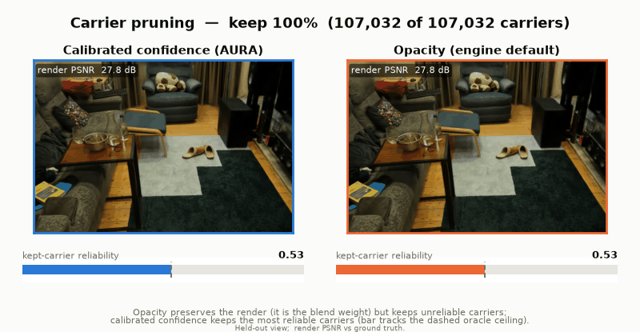
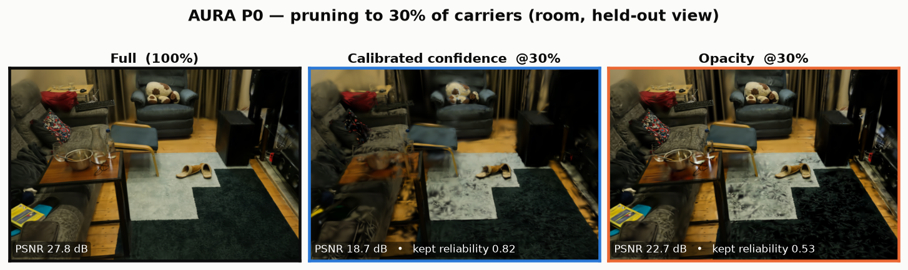
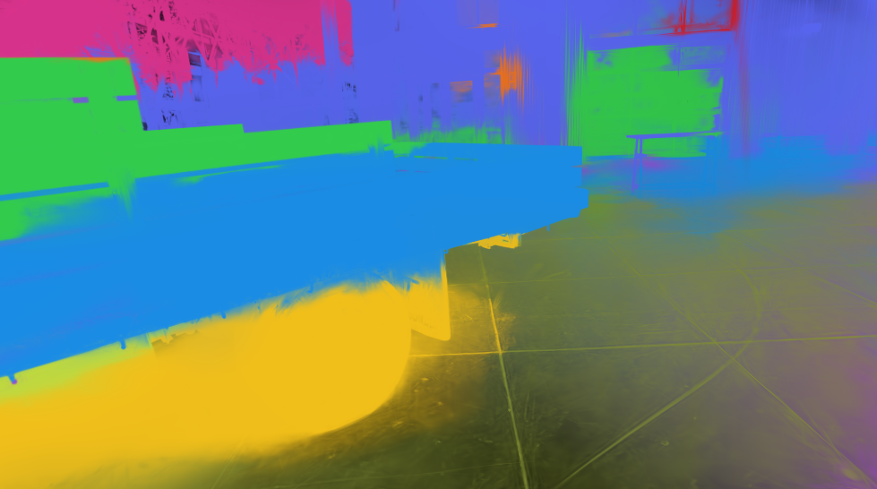
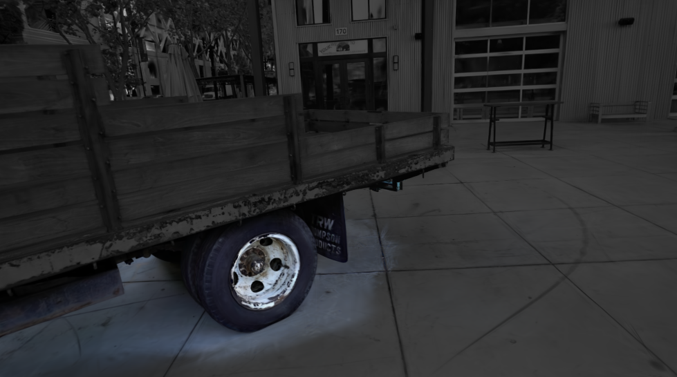

# AURA

**Adaptive Unified Radiance Asset** · research preview (`v0.1.0-dev`)

AURA turns posed captures into a **typed, queryable, relightable, engine-ready
radiance asset**. It keeps the fast Gaussian / DBS-Beta renderers where they are
strong and adds the asset layer they do not provide: a **calibrated, certified
confidence** every carrier carries, plus typed-carrier metadata, ray queries,
semantic identity, a relighting preview, PRISM extension footprints, and
standards-based export. The chain is Photogrammetry → NeRF → 3DGS → **AURA**: not
a faster renderer, but a more *trustworthy, inspectable* asset on top of one.

This is a research preview. Every claim below is backed by a committed artifact,
and the honest scope of each capability — what is trained-and-validated versus
demo-stage — is stated inline. Negatives are kept, not hidden.

<p align="center">
  <br>
  <em>Truck reconstructed as an AURA asset.</em>
</p>


<p align="center">
  <br>
  <em>Asset operations: reconstruction, depth, confidence, semantics, and open-vocabulary query.</em>
</p>

## The killer property: calibrated, certified, exported confidence

A plain 3DGS/DBS checkpoint has no notion of per-primitive trust. AURA exports,
per carrier, a **calibrated** confidence `c ∈ [0,1]` — carriers reported at
confidence `p` are reliable ≈ `p` of the time — plus a **distribution-free pruning
certificate**: *drop everything below threshold `τ`, losing at most `ε`
reliability mass, with confidence `1−α`.* That turns level-of-detail, streaming,
and pruning decisions from heuristics into *certified* choices, and the value
travels with the asset as the `_AURA_CONFIDENCE` vendor attribute in the
`KHR_gaussian_splatting` export. This is the capability a bare splat cannot
cheaply add — AURA's answer to "what does an asset give you that a renderer does
not."

Validated end-to-end on **four real scenes**: Truck (129k carriers) and three
Mip-NeRF 360 scenes — Garden (outdoor, 120k), Kitchen (indoor, 120k), Room
(indoor, 107k). The export-time feature (train-view colour agreement) predicts
held-out reliability; the shipped view-count heuristic and opacity do not:

| signal vs held-out reliability (corr) | Truck | Garden | Kitchen | Room |
|---|---:|---:|---:|---:|
| **train-view colour agreement** (export-time feature) | **0.91** | **0.93** | **0.98** | **0.96** |
| view-count heuristic (raw shipped value) | −0.05 | −0.13 | −0.01 | 0.05 |
| opacity (engine pruning default) | −0.18 | 0.16 | 0.08 | 0.05 |
| calibration ECE (raw → calibrated) | 0.59→0.001 | 0.55→0.002 | 0.56→0.001 | 0.46→0.002 |

Isotonic calibration drops ECE by ~300–900× on every scene. The headline metric
is **selection AUC** — mean retained reliability across pruning budgets. Calibrated
confidence lands **within 1–4% of the oracle ceiling** on every scene and beats
opacity, the raw heuristic, and random at *every* budget (calibrated 0.58–0.72 vs
opacity 0.37–0.53, itself at or below random). At a 10%-keep budget it retains
0.77–0.90 reliability vs opacity's 0.31–0.49.



**Pruning sweep (Room, held-out view).** As carriers are pruned 100%→10%, the
reliability of what is *kept* (bottom meters) is the P0 axis: calibrated-confidence
pruning (left) tracks the oracle ceiling — retained reliability rises to **0.90 at
a 10%-keep budget** — while opacity pruning (right) stays near random (**~0.50**).



**Honest caveat (verified, not the naive story).** The *rendered image* degrades
faster under confidence pruning than under opacity pruning — opacity holds a higher
render PSNR at every budget (30%-keep: **22.7 dB opacity vs 18.7 dB confidence**).
This is structural, not a bug: opacity *is* the alpha-compositing blend weight, so
keeping the highest-opacity carriers preserves the pixels you see almost by
construction (which is why opacity pruning is the 3DGS standard). P0 optimizes the
*other* axis — opacity keeps a good-looking render of **unreliable** carriers with
no guarantee, whereas calibrated confidence keeps carriers that agree with held-out
observations and ships a distribution-free certificate. The two signals optimize
different things.



The property **survives an occlusion-aware reliability label** (`--label
depth_aware`, which counts a carrier only in held-out views where it is the visible
front surface): calibrated confidence stays within 1–9% of the oracle and still
beats opacity on all four scenes, with the export-time feature still predicting
reliability at r = 0.75–0.97. Two conservative caveats remain: the reliability
label is a colour-agreement proxy, not a photometric render loss, and the depth
buffer is a coarse block z-buffer — both under-credit rather than over-credit a
carrier.

```bash
aura calibrate-confidence <package> <reliability.npz>   # fit + wire into KHR export
```

Authoritative deep-dive (method, per-scene tables, both reliability labels, the
conformal certificate): [`docs/P0_CALIBRATED_CONFIDENCE.md`](docs/P0_CALIBRATED_CONFIDENCE.md).

## The asset contract

Beyond rendering, an `.aura` asset exposes a fixed set of first-class operations.
Each is described here with its honest maturity.

### Typed carriers

One contract covers four footprint families, each routed to the backend that
serves it best:

| Carrier | Default path | Role | Maturity |
|---|---|---|---|
| Gaussian | gsplat | primary quality rasterization | trained on real scenes |
| Beta | DBS-Beta | primary typed-carrier quality path | trained on real scenes |
| Gabor | PRISM | additive high-frequency extension | demo-stage (2D crops only) |
| Neural | PRISM | additive experimental extension | demo-stage (experimental) |

Gaussian and Beta are the quality backends and train on full scenes. Gabor and
Neural are **additive PRISM extensions**, not alternative quality backends — Gabor
currently trains only on 2D crops and the neural footprint is experimental. PRISM
(Pluggable Radiance-prImitive Splatting Module, pure-PyTorch + a custom CUDA path)
verifies that Gaussian/Beta route to the primary backend, Gabor/Neural route to
PRISM, and the extension measurably changes the rendered image. It is real-time on
an RTX 5090 (hundreds of FPS at 50k carriers, CUDA forward matching the torch path
> 100 dB), artifact recorded in `experiments/results/production_fps_sweep_2026-06-25.json`.


### Ray query and confidence

The asset answers a unified ray-query payload over trained carriers, and every
carrier carries the calibrated confidence above.

```bash
aura ray-query scene.aura --origin 0 0 0 --direction 0 0 1
aura confidence scene.aura scene/manifest.json
```

Scope note: ray-query is currently a **brute-force O(N)** traversal (distance to
all carriers + argsort), and the secondary-ray / reflection path is validated on a
demo scene, not yet a BVH-accelerated production traversal.

| Confidence heatmap | Expected-depth orbit |
|---|---|
|  |  |

### Relight preview

Carriers carry surface/material fields, so the same asset can be previewed under
changed lighting without changing geometry.

```bash
aura relight-preview scene.aura scene/manifest.json --output relit.ppm
```

Scope note: this is a **relighting preview** (albedo from the baked SH DC term,
normals from the carrier covariance short axis), not yet data-driven inverse
rendering — no optimization from observations and no TensoIR/Stanford-ORB
evaluation. It is honest scaffolding for the material path, not an inverse-rendering
claim.


### Semantics and open-vocabulary query

AURA lifts multi-view DINO features onto carriers and answers CLIP-style text
queries for group-level retrieval. The same-split A/B promotes a DINOv3
small/timm path (semantic cluster budget 12): truck, wheel, ground, and building
resolve to four distinct groups with an aggregate query margin above the DINOv2
baseline, while DINOv2 keeps the stronger wheel-only margin (both recorded).


| A/B | DINOv2 | DINOv3 |
|---|---|---|
| 14-view carrier groups |  |  |
| Wheel query highlight |  |  |

### Export

The export path writes real engine-facing assets instead of leaving results as an
experiment-only checkpoint.

```bash
aura export-splat scene.aura --output scene.glb           # KHR_gaussian_splatting GLB
aura export-usd   scene.aura --output scene.usda          # dependency-free ASCII preview
aura export-usd   scene.aura --schema --output scene.usda # OpenUSD 26.03 splat schema
aura validate-package scene.aura
aura inspect-package  scene.aura
```

- **`KHR_gaussian_splatting` GLB** with position, colour/opacity, rotation, scale,
  and SH payloads — and the calibrated `_AURA_CONFIDENCE` vendor attribute.
- **USD export**: a dependency-free ASCII preview bridge for scene-graph / DCC
  workflows, plus the official **OpenUSD 26.03** `UsdVolParticleField3DGaussianSplat`
  schema via `--schema` (native splat prim with a confidence vendor channel;
  requires `usd-core`).
- **`.aura` package + `carriers.npz` sidecar** for fast local rendering/eval.

Third-party viewer compatibility is a **structural** check, not a runtime guarantee.

## Quickstart

```bash
python -m venv .venv && source .venv/bin/activate
pip install --upgrade pip
pip install -e ".[dev,gpu,assets]"
```

For CUDA-first local work use the GPU environment when available
(`source .gpu_venv/bin/activate`). The DBS-Beta fork installs under the `gsplat`
package name and is kept isolated in `.dbs_venv` — never mix the two.

```bash
# 1. Build a capture manifest from COLMAP.
aura colmap-to-capture-manifest data/tanks/truck/sparse/0 \
  --root data/tanks/truck --image-dir data/tanks/truck/images \
  --output outputs/truck-manifest.json --point-seeded

# 2. Train carriers.
aura train-gsplat outputs/truck-manifest.json --output outputs/truck.aura --scale 1.0

# 3. Use the asset.
aura render     outputs/truck.aura --backend torch --output docs/view.ppm
aura export-splat outputs/truck.aura --output docs/truck.glb
aura ray-query  outputs/truck.aura --origin 0 0 0 --direction 0 0 1
```

## Training backends

AURA trains carriers on two mature backends, each in its own isolated venv:
**gsplat** (Gaussian) and a **DBS-Beta fork** (Beta typed carriers). On matched
carrier budgets the Beta path **reproduces the quality result of Deformable Beta
Splatting** (DBS, [arXiv:2501.18630](https://arxiv.org/abs/2501.18630)):

- Beta beats the fixed-Gaussian control on **every** audited scene, **mean +0.80 dB
  PSNR**.
- On Truck at a matched 1M-carrier budget, Beta wins by **+0.33 dB** and reaches
  comparable quality at **~half the carriers**.

This reproduces DBS's published claim — it is **not** an AURA novelty — and the
control is a **frozen-β DBS ablation, not real gsplat 3DGS**, with Mip-NeRF 360
evaluated at image downsamples. The honest findings that come with it (nobody else
has published these) are the interesting part:

- The typed +dB win **decomposes to a spherical-Beta colour model** (~+0.4 dB), not
  to per-carrier adaptivity (~0).
- **Adaptive per-carrier β does not beat a good global β** (learned 26.352 <
  uniform β=2, 26.421).
- **Cross-family mix-routing never beats the best single family.**
- An earlier +0.8 dB "typed win" was a camera-roll pose-bug artifact (fixed).

### Truck compactness

| Representation | PSNR | SSIM | LPIPS | Carriers |
|---|---:|---:|---:|---:|
| fixed Gaussian | 26.02 | 0.890 | 0.128 | 1.0 M |
| AURA Beta | **26.35** | **0.896** | **0.122** | 1.0 M |
| AURA Beta | 26.07 | 0.890 | 0.139 | **0.5 M** |


### Multi-scene typed-carrier quality

| Scene | AURA Beta PSNR | Fixed Gaussian PSNR | Delta |
|---|---:|---:|---:|
| bicycle | 25.15 | 24.84 | +0.30 |
| bonsai | 34.03 | 32.27 | +1.76 |
| counter | 30.32 | 28.81 | +1.51 |
| garden | 27.27 | 26.64 | +0.63 |
| kitchen | 32.37 | 31.29 | +1.09 |
| room | 32.78 | 32.29 | +0.49 |
| stump | 26.64 | 26.46 | +0.19 |
| truck | 26.39 | 25.96 | +0.43 |

**Mean gain: +0.80 dB PSNR.**

 


Train is included as local image-sequence and COLMAP-sparse evidence rather than a
trained DBS-Beta checkpoint:

| Train image sweep | Train sparse depth |
|---|---|
|  |  |

## Results and validation

**Publication gate.** The artifact-backed gate report passes **11/11**:

```text
experiments/results/publication_validation_2026-06-25.json
publicationReady: true · passedGateCount: 11 · remainingGateIds: []
```

Gates cover local multi-scene quality, dataset audit, the PRISM additive contract
and CUDA throughput, real trained-scene FPS, engine/viewer export integration,
learned LPIPS on CUDA, the external-method baseline table, and secondary-ray /
inverse-material validation. Regenerate with
`aura publication-validation-report --output experiments/results/publication_validation.json`.

**Render speed.** Trained Truck checkpoints render above 30 FPS on an RTX 5090 —
DBS-Beta 46 FPS, fixed-Gaussian control 49 FPS (979×546,
`experiments/results/real_scene_fps_sweep_2026-06-25.json`). This is a
trained-checkpoint render-speed measurement, not a full-scene leaderboard FPS
claim.

**External same-split baselines.** Local smoke rows plus official 2DGS and 3DGUT
run as 30k same-split GPU rows on all 8 audited scenes
(`experiments/results/external_baselines_2026-06-24.json`,
`official_multiscene_baselines_2026-06-25.json`):

| Baseline row | PSNR | SSIM | LPIPS | Boundary |
|---|---:|---:|---:|---|
| COLMAP sparse SfM | 8.9952 | 0.049027 | 0.757455 | local CUDA smoke |
| compact NeRF | 8.6726 | 0.126395 | 0.971559 | local 1-iter CUDA smoke |
| 3DGS / gsplat-control | 26.0172 | 0.890420 | 0.127743 | executed fixed-Gaussian control |
| 2DGS-style surfel | 10.7072 | 0.177134 | 0.645361 | local smoke/protocol row |
| ray-traced-GS-style | 6.7688 | 0.066934 | 0.822136 | local smoke/protocol row |
| official 2DGS Truck | 25.1223 | 0.873086 | 0.173525 | official repo, 30k steps, Truck native |
| official 3DGUT Truck | 25.3198 | 0.878045 | 0.183758 | official repo, 30k steps, Truck native |
| official 2DGS Room | 30.5354 | 0.906617 | 0.243403 | official repo, 30k steps, Mip-360 Room images_2 |
| official 3DGUT Room | 31.4958 | 0.918965 | 0.296945 | official repo, 30k steps, Mip-360 Room ds=2 |
| official 2DGS Bicycle | 24.5921 | 0.711770 | 0.306886 | official repo, 30k steps, Mip-360 Bicycle images_2 |
| official 3DGUT Bicycle | 24.3068 | 0.696055 | 0.359877 | official repo, 30k steps, Mip-360 Bicycle ds=2 |
| official 2DGS Bonsai | 31.2977 | 0.931000 | 0.226856 | official repo, 30k steps, Mip-360 Bonsai images_2 |
| official 3DGUT Bonsai | 32.4276 | 0.944540 | 0.251687 | official repo, 30k steps, Mip-360 Bonsai ds=2 |
| official 2DGS Counter | 28.0533 | 0.893028 | 0.229328 | official repo, 30k steps, Mip-360 Counter images_2 |
| official 3DGUT Counter | 29.1397 | 0.910729 | 0.257860 | official repo, 30k steps, Mip-360 Counter ds=2 |
| official 2DGS Garden | 26.6861 | 0.833891 | 0.164357 | official repo, 30k steps, Mip-360 Garden images_2 |
| official 3DGUT Garden | 26.3824 | 0.801139 | 0.241828 | official repo, 30k steps, Mip-360 Garden ds=2 |
| official 2DGS Kitchen | 30.2164 | 0.915704 | 0.147227 | official repo, 30k steps, Mip-360 Kitchen images_2 |
| official 3DGUT Kitchen | 30.8491 | 0.926038 | 0.159499 | official repo, 30k steps, Mip-360 Kitchen ds=2 |
| official 2DGS Stump | 26.0513 | 0.749460 | 0.293722 | official repo, 30k steps, Mip-360 Stump images_2 |
| official 3DGUT Stump | 26.3474 | 0.758430 | 0.360993 | official repo, 30k steps, Mip-360 Stump ds=2 |

Completed counts: official 2DGS 8/8 scenes, official 3DGUT 8/8 scenes, local
gsplat-control 3DGS 8/8 scenes. The SOTA A/B artifact
(`sota_ab_validation_2026-06-25.json`) promotes the DINOv3-small/timm, official
2DGS, and 3DGUT providers.

## Limitations and claim boundary

AURA is a research preview; the honest boundary is part of the product.

- **Local artifact-backed A/B readiness only — no official-leaderboard SOTA claim**,
  and no production-FPS-everywhere claim.
- The typed-carrier quality win **reproduces DBS** against a frozen-β control (not
  real gsplat 3DGS), with Mip-360 eval at image downsamples; it is not an AURA
  novelty.
- **Ray-query is brute-force O(N)**; secondary rays are validated on a demo scene.
- **Relighting is a preview** (baked-SH albedo, covariance normals), not data-driven
  inverse rendering.
- **Only Gaussian and Beta train on real scenes**; Gabor is 2D-crop-only and Neural
  is experimental (both additive PRISM extensions).
- The P0 reliability label is a **colour-agreement proxy** and the occlusion buffer
  is a coarse block z-buffer — both conservative.
- Third-party viewer compatibility is a **structural** check, not a runtime
  guarantee.
- 8 scenes only; two Mip-360 scene lists are placeholders; there is no CI, and the
  custom CUDA path is sm_120-only (RTX 5090).

## Roadmap and history

Dated, per-change history lives in [`CHANGELOG.md`](CHANGELOG.md) — including the
full P0 development arc and the typed-carrier asset foundation. Near-term
directions: a true gsplat-3DGS matched-budget control and full-resolution eval;
binding self-graded gates to real-scene rendered evaluations; a BVH-accelerated
ray-query; SPZ4 compressed export carrying the confidence channel; and making a
third carrier real (or scoping the registry claim to two).

## Reproduce the evidence

Most headline artifacts regenerate from `experiments/` (accuracy jobs run fine on
shared GPUs; only FPS rows need an idle machine):

```bash
bash scripts/fetch_scene.sh truck data/tanks/truck
bash experiments/run_multiscene.sh 7000 1 && python experiments/collect_multiscene.py
python experiments/per_carrier_reliability.py --aura outputs/<scene>-gsplat.aura \
  --manifest outputs/<scene>-manifest.json --out outputs/reliability_<scene>.npz
python experiments/calibrate_confidence.py --reliability outputs/reliability_<scene>.npz \
  --scene <scene> --report outputs/calib_<scene>.json
python experiments/make_p0_selection_auc_figure.py
python experiments/make_pruning_sweep_gif.py --scene room --frame 8
python experiments/prism_additive_validation.py
python experiments/external_baseline_smokes.py --device cuda
aura publication-validation-report --output experiments/results/publication_validation_2026-06-25.json
```

## Repository map

```text
src/aura/
  calibration.py      calibrated confidence + conformal pruning certificate (P0)
  confidence.py       raw per-carrier confidence signal
  gltf_splat.py       KHR_gaussian_splatting export (+ _AURA_CONFIDENCE)
  usd_writer.py       OpenUSD 26.03 UsdVolParticleField3DGaussianSplat schema
  hybrid.py           primary backend + PRISM extension routing
  prism.py            torch PRISM rasterizer      prism_cuda.py  CUDA PRISM path
  relight.py          relighting preview layer    carrier_query.py  ray-query payloads
  publication.py      artifact-backed gate report readiness.py  production boundary
  carrier_io.py       fast carriers.npz sidecar   schemas/  .aura package schemas

scripts/       dataset, eval, baseline, and DBS bridge utilities
experiments/   reproduction scripts and figure/GIF generators
tests/         contract, renderer, validation, and CLI tests
docs/          README figures, GIFs, and the P0 deep-dive
```

## License

MIT. See [LICENSE](LICENSE).
</content>
