# AURA

[](https://github.com/Archerkattri/aura/actions/workflows/ci.yml)

**Adaptive Unified Radiance Asset** · research preview (`v1.0.0`)

AURA is the **trust layer for splats**. A plain 3DGS/DBS checkpoint renders fast
but ships no notion of per-primitive trust; AURA keeps those fast Gaussian /
DBS-Beta renderers where they are strong and adds the layer they do not provide —
a **calibrated confidence** every carrier carries, turned into a **distribution-free
certificate**, turned into a **certified streaming/LOD ladder**, with that
confidence **travelling in every standard container** (glTF, USD, SPZ), and all of
it **gate-checked and CPU-reproducible**. The chain is Photogrammetry → NeRF → 3DGS
→ **AURA**: not a faster renderer, but a more *trustworthy, inspectable* asset on
top of one.

This is **`v1.0.0`**, a scoped release with documented limitations (see
[v1.0 Known Limitations](#v10-known-limitations)). It ships the trust-layer
contribution complete and honestly bounded; the items it does *not* close (a full
8-scene true-3DGS control, external reproduction, and a handful of demo-stage
carriers) are stated as open, not implied done. Every claim below is backed by a
committed artifact, and the honest scope of each capability — what is
trained-and-validated versus demo-stage — is stated inline. **Negatives are kept,
not hidden; there is no official-leaderboard SOTA claim anywhere in this repo.** A
preprint describing the calibrated-confidence result accompanies this release.

**Who it's for:** researchers and graphics/vision engineers who already have (or can
produce) a 3DGS/DBS reconstruction and want a per-carrier reliability they can *trust*,
*prune by*, *stream by*, and *export* — reviewers reproducing the paper, and pipeline
authors who need a confidence channel that survives glTF/USD/SPZ interchange.

**Contents:** [Killer property](#the-killer-property-calibrated-certified-exported-confidence) ·
[Certified LOD](#certified-lod--streaming) · [Asset contract](#the-asset-contract) ·
[Exports & interchange](#exports--interchange) · [Quickstart](#quickstart) ·
[Training backends](#training-backends) ·
[Verification & reproducibility](#verification-and-reproducibility) ·
[Limitations & claim boundary](#limitations-and-claim-boundary) ·
[v1.0 Known Limitations](#v10-known-limitations) · [Repository map](#repository-map) ·
[License](#license)

<p align="center">
  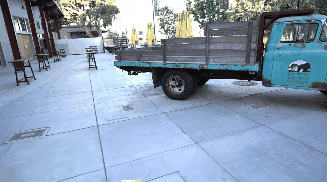<br>
  <em>Truck reconstructed as an AURA asset.</em>
</p>

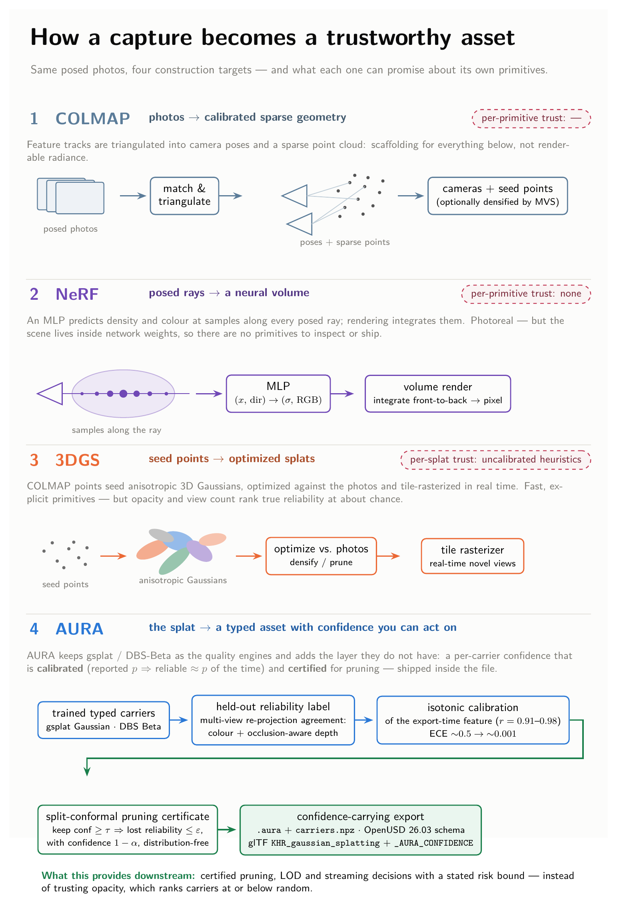
*Same posed photos, four construction targets. COLMAP gives geometry scaffolding, NeRF a neural volume with no primitives to ship, 3DGS fast splats whose only per-splat signals are uncalibrated heuristics — and AURA adds the layer with a guarantee: reliability label → isotonic calibration → split-conformal certificate → confidence-carrying export. Validated on 4 real scenes at native resolution; the calibrator transfers across scenes (selection AUC within ±0.0004) and the property survives a render-loss label with honestly weaker margins. Honest scope: Gaussian + Beta are the trained carriers, Gabor / neural footprints are demo-stage PRISM extensions, quality numbers are DBS reproductions rather than AURA novelties, and no SOTA claim is made.*

<p align="center">
  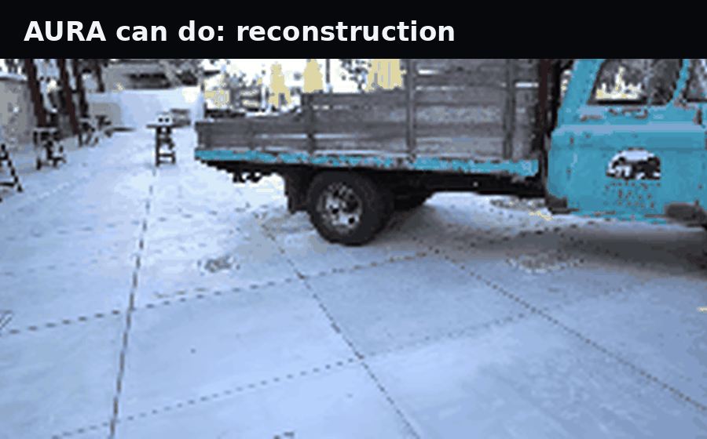<br>
  <em>Asset operations: reconstruction, depth, confidence, semantics, and open-vocabulary query.</em>
</p>

## The killer property: calibrated, certified, exported confidence

A plain 3DGS/DBS checkpoint has no notion of per-primitive trust. AURA exports,
per carrier, a **calibrated** confidence `c ∈ [0,1]` — carriers reported at
confidence `p` are reliable ≈ `p` of the time — plus a **distribution-free pruning
certificate**: *drop everything below threshold `τ`, losing at most `ε`
reliability mass, with confidence `1−α`.* That turns level-of-detail, streaming,
and pruning decisions from heuristics into *certified* choices, and the value
travels with the asset — as the `_AURA_CONFIDENCE` vendor attribute in the
`KHR_gaussian_splatting` GLB export, as `primvars:aura:confidence` in the OpenUSD
26.03 splat schema, and as a confidence sidecar next to the Niantic SPZ v4 export.
This is the capability a bare splat cannot cheaply add — AURA's answer to "what
does an asset give you that a renderer does not."

The raw signal AURA used to ship — a view-count heuristic — is *not* a probability:
it saturates near 1 regardless of whether a carrier is actually reliable. Isotonic
(PAVA) calibration fixes that, collapsing every scene onto the calibration diagonal
and dropping expected calibration error (ECE) by ~300–900×:

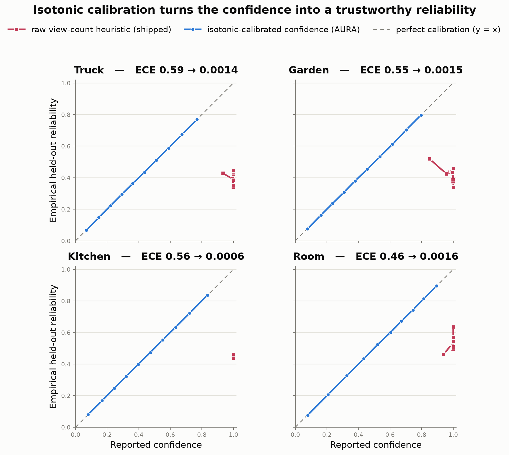
*Reliability diagrams on the held-out eval split (10 equal-count bins per curve). In every scene the shipped view-count heuristic reports ~1.0 regardless of true reliability; isotonic (PAVA) calibration places the reported value on the diagonal, cutting ECE ~300–900×. Sources: `outputs/reliability_<scene>.npz`, `outputs/calib_<scene>.json`.*

Validated end-to-end on **four real scenes**: Truck (129k carriers) and three
Mip-NeRF 360 scenes — Garden (outdoor, 120k), Kitchen (indoor, 120k), Room
(indoor, 107k). The export-time feature (train-view colour agreement) predicts
held-out reliability; the shipped view-count heuristic and opacity do not:

| signal vs held-out reliability (corr) | Truck | Garden | Kitchen | Room |
|---|---:|---:|---:|---:|
| **train-view colour agreement** (export-time feature) | **0.91** | **0.93** | **0.98** | **0.96** |
| view-count heuristic (raw shipped value) | −0.05 | −0.13 | −0.01 | 0.05 |
| opacity (engine pruning default) | −0.18 | 0.16 | 0.08 | 0.05 |
| calibration ECE (raw → calibrated) | 0.59→0.001 | 0.55→0.002 | 0.56→0.001 | 0.46→0.002 |

The headline metric is **selection AUC** — mean retained reliability across pruning
budgets. Calibrated confidence lands **within 1–4% of the oracle ceiling** on every
scene and beats opacity, the raw heuristic, and random at *every* budget (calibrated
0.58–0.72 vs opacity 0.37–0.53, itself at or below random). At a 10%-keep budget it
retains 0.77–0.90 reliability vs opacity's 0.31–0.49:

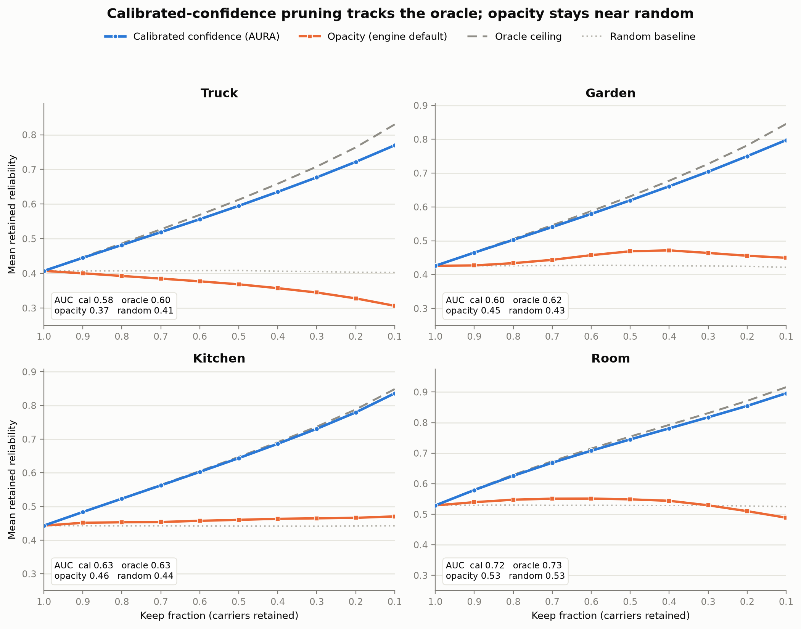
*Lower keep fractions = more aggressive pruning (x-axis reversed). On every scene the calibrated curve hugs the oracle ceiling and beats opacity at every budget; opacity sits at or below random.*

**Pruning sweep (Room, held-out view).** As carriers are pruned 100%→10%, the
reliability of what is *kept* (bottom meters) is the P0 axis: calibrated-confidence
pruning (left) tracks the oracle ceiling — retained reliability rises to **0.90 at
a 10%-keep budget** — while opacity pruning (right) stays near random (**~0.50**).

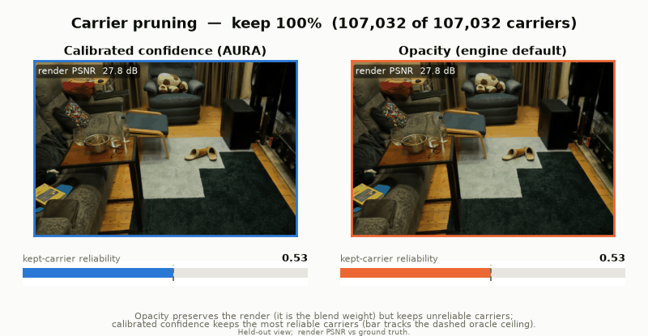

**Honest caveat (verified, not the naive story).** The *rendered image* degrades
faster under confidence pruning than under opacity pruning — opacity holds a higher
render PSNR at every budget (30%-keep: **22.7 dB opacity vs 18.7 dB confidence**).
This is structural, not a bug: opacity *is* the alpha-compositing blend weight, so
keeping the highest-opacity carriers preserves the pixels you see almost by
construction (which is why opacity pruning is the 3DGS standard). P0 optimizes the
*other* axis — opacity keeps a good-looking render of **unreliable** carriers with
no guarantee, whereas calibrated confidence keeps carriers that agree with held-out
observations and ships a distribution-free certificate. The two signals optimize
different things.

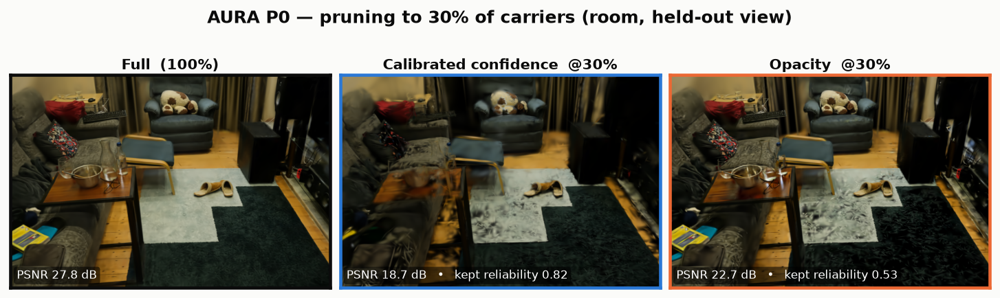

The property **survives an occlusion-aware reliability label** (`--label
depth_aware`, which counts a carrier only in held-out views where it is the visible
front surface): calibrated confidence stays within 1–9% of the oracle and still
beats opacity on all four scenes, with the export-time feature still predicting
reliability at r = 0.75–0.97. Two conservative caveats remain: the reliability
label is a colour-agreement proxy, not a photometric render loss, and the depth
buffer is a coarse block z-buffer — both under-credit rather than over-credit a
carrier.

```bash
aura calibrate-confidence <package> <reliability.npz>   # fit + wire into KHR export
```

Authoritative deep-dive (method, per-scene tables, both reliability labels, the
conformal certificate): [`docs/P0_CALIBRATED_CONFIDENCE.md`](docs/P0_CALIBRATED_CONFIDENCE.md).

### P1 — cross-scene transfer + certificate operating study

A calibrator fit on one scene transfers to another. Because selection/pruning
quality is rank-based and isotonic calibration is monotone, transferred selection
AUC matches in-scene within **±0.0004 on all 24 off-diagonal scene pairs**;
absolute calibration (ECE) degrades gracefully — transferred 0.008 (colour) / 0.026
(depth) on average, worst case 0.017 / 0.058 — still 1–2 orders of magnitude below
the uncalibrated ~0.54, and the conformal certificate stays valid when a small local
conformal split is kept on the target scene:

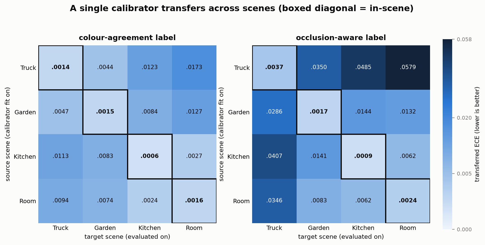
*Off-diagonal = calibrator fit on the source scene, applied to the target. Every transferred ECE stays 1–2 orders of magnitude below the uncalibrated raw heuristic (~0.54); selection/pruning AUC transfers within ±0.0004 because the isotonic map is rank-preserving. Truck is the object-centric outlier.*

The honest deployment recipe is **"ship one calibrator + a small per-scene conformal
set."** The certificate's selective regime is mapped on all four scenes × both
labels (onset ε* 0.47–0.62, tracking scene reliability). Details, the full 4×4×2
matrix, and the ε-sweep: [`docs/P1_CROSS_SCENE.md`](docs/P1_CROSS_SCENE.md).

### P2 — full resolution + a render-loss label

Two stress-tests: re-fitting carriers at **full resolution** (P0 optimised at
`--scale 0.25`) and replacing the colour-agreement proxy with a label measured from
the **actual alpha-composited render** (each carrier's exact blend-weighted
rendering error on held-out views). The P0 story **holds at full resolution** —
full-res and a 0.25 control are near-identical, so it is not a low-res artifact —
and it **survives the render-loss label** with honestly weaker margins:

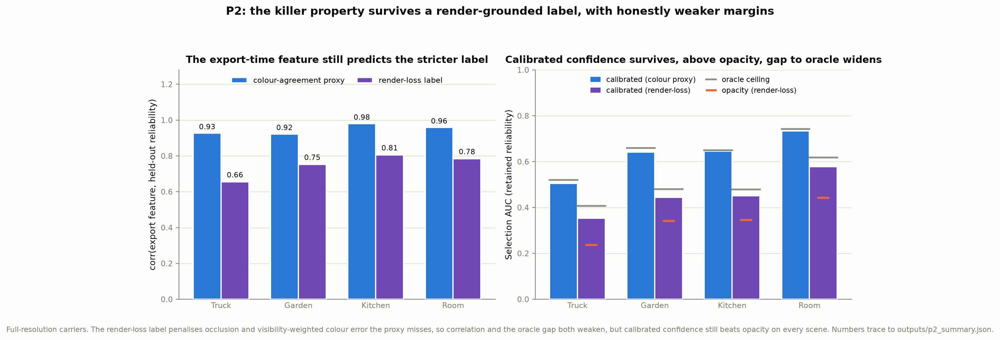
*Full-resolution carriers. The render-loss label penalises occlusion and visibility-weighted colour error the proxy misses, so correlation weakens and the calibrated-to-oracle gap widens from ~1–3% to ~6–13% — but calibrated confidence still beats opacity on every scene. Numbers trace to `outputs/p2_summary.json`.*

Under the render-grounded label the export-time feature predicts reliability at
r ≈ 0.66–0.81 (vs the proxy's 0.92–0.98), calibration still crushes ECE by 2–3
orders, and calibrated confidence still beats opacity on every scene with the oracle
gap widening to ~6–13%.

**P2 also fixes a P0 evaluation leak** — P0 trained on *all* frames, so its
"held-out" reliability views were seen in training. On the clean, genuinely held-out
split the absolute numbers are slightly lower and *honest*: **the Truck colour
pruning certificate that P0 reported as keeping 100% of carriers at ε=0.6 certifies
keeping 77% on the clean split (1.00 → 0.77).** The conclusions are stated relative
to each run's own oracle ceiling and to opacity, which is what transfers. This leak
class is now **mechanically impossible to reintroduce**: the calibration gate is
guarded by `aura.split_guard`, which reconstructs the train/eval partition from a
producer's recorded view counts and fails the gate if an eval view was ever a train
view (the exact fingerprint of the historical leak). Details, per-scene tables, and
the exact-attribution method: [`docs/P2_FULLRES_RENDERLOSS.md`](docs/P2_FULLRES_RENDERLOSS.md).

## Certified LOD / streaming

P4 makes the pruning certificate *do something*. One certificate becomes an
**ordered, multi-level streaming plan**: carriers stream in **descending calibrated
confidence**, and a consumer may **stop at any published level** with a stated,
distribution-free bound on the reliability mass it discarded by stopping there —
the level-of-detail ladder a bare 3DGS/DBS splat cannot offer.

With `K = 4` published keep-levels (`0.10 / 0.25 / 0.50 / 1.00`), each level's
discarded-reliability-mass bound `ε_k` is a finite-sample Hoeffding upper bound
computed on the **calibration half only**. Only the `R = 3` **non-trivial** levels
(`f < 1`) are *random* certificates; the `1.00` level is a *deterministic* statement
(`ε = 0` by definition, nothing pruned — no interval). By the union bound the
deterministic level costs no error budget, so we split `α` over the `R` random levels
only: each is certified at **`α' = α/R` (Bonferroni over the non-trivial levels)** —
`α/3 ≈ 0.0333`, not `α/4 = 0.025` — giving **family-wise confidence `1−α` = 0.9**
across the whole plan at strictly tighter `ε_k` than the naive `α/K` correction:

| keep fraction | Truck `ε` | Garden `ε` | Kitchen `ε` | Room `ε` |
|---|---:|---:|---:|---:|
| 0.10 | 0.334 | 0.347 | 0.364 | 0.443 |
| 0.25 | 0.236 | 0.245 | 0.254 | 0.318 |
| 0.50 | 0.110 | 0.122 | 0.126 | 0.160 |
| 1.00 | 0.000 (trivial) | 0.000 (trivial) | 0.000 (trivial) | 0.000 (trivial) |

**All 16 bounds hold** (12 non-trivial + 4 trivial) on the **disjoint eval half** of
every scene — the same seed-0 50/50 split used to fit the calibrator; the eval half
never touches plan construction. Read the numbers correctly: keeping only 10% of
carriers discards a *large* share of the scene's total reliability mass (`ε ≈
0.33–0.44`) even though the kept 10% are each individually very reliable (P0: 0.77–
0.90 mean retained reliability at 10%-keep) — there are simply many moderately-
reliable carriers, so a hard prune forfeits much of the aggregate mass, and the
certificate bounds that forfeited mass honestly. `ε_k` bounds a *reliability-mass*
proxy, not rendered PSNR (opacity remains the PSNR-preserving prune signal — same
caveat as P0/P2), and the guarantee is exchangeability-dependent, so cross-scene
deployment needs a small local conformal set per scene.

```bash
aura lod-plan outputs/reliability_truck.npz --scene truck   # emit a certified plan as JSON
```

Method, the full per-level `τ` / `ε_certified` / empirical-loss tables, and the
plateau-rounding correctness finding: [`docs/P4_CERTIFIED_LOD.md`](docs/P4_CERTIFIED_LOD.md)
(artifact: `outputs/lod_certified.json`).

## The asset contract

Beyond rendering, an `.aura` asset exposes a fixed set of first-class operations.
Each is described here with its honest maturity.

### Typed carriers

The registry defines **seven carrier types**, but they are not equally real, and
each carries an explicit `maturity` flag (`trained` / `demo` / `metadata`) — a
contract **enforced by a publication gate** (`carrier_registry_honesty`), so the
asset can never advertise more than it can back. Four types have render footprints,
routed to the backend that serves each best; the other three (surface, volume,
semantic) are typed-metadata contracts only — no trained render family stands
behind them yet:

| Carrier | Default path | Role | Maturity |
|---|---|---|---|
| Gaussian | gsplat | primary quality rasterization | trained on real scenes |
| Beta | DBS-Beta | primary typed-carrier quality path | trained on real scenes |
| Gabor | PRISM | additive high-frequency extension | demo-stage (2D crops only) |
| Neural | PRISM (Gaussian fallback) | experimental footprint | demo-stage (experimental, unvalidated) |
| Surface / Volume / Semantic | — | typed-metadata contract | metadata only |

Gaussian and Beta are the quality backends and train on full scenes, each with
committed `calib_<scene>.json` evidence — the gate **fails** if any type claims
`trained` without it. Gabor and Neural are **additive PRISM extensions**, not
alternative quality backends — Gabor currently trains only on 2D crops. The neural
footprint is experimental and unvalidated: PRISM ships **no** neural kernel, so a
neural carrier is composited via an **explicit, provenance-annotated Gaussian
fallback** (`hybrid.footprint_routing` reports `fallback:gaussian` and
`render_hybrid` emits a `RuntimeWarning`), never a silent swap, and its research
factory (`prism.make_neural_footprint`) is quarantined behind
`enable_experimental=True`. PRISM (Pluggable Radiance-prImitive Splatting Module,
pure-PyTorch + a custom CUDA path) verifies that Gaussian/Beta route to the primary
backend, Gabor routes to a real PRISM footprint, and the extension measurably
changes the rendered image. It is real-time on an RTX 5090 (hundreds of FPS at 50k
carriers, CUDA forward matching the torch path > 100 dB), artifact recorded in
`experiments/results/production_fps_sweep_2026-06-25.json`. The registry-honesty
contract and per-type truth table: [`docs/P6_CARRIER_REGISTRY_AND_CODEBOOK.md`](docs/P6_CARRIER_REGISTRY_AND_CODEBOOK.md).

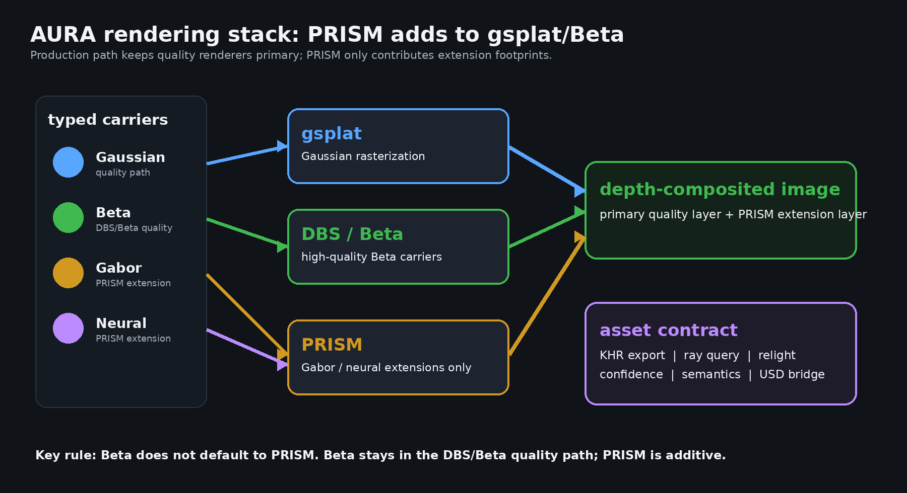

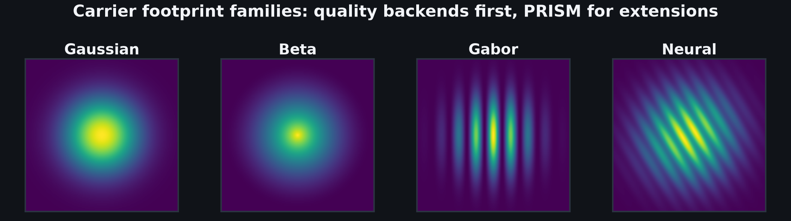

### Ray query and confidence

The asset answers a unified ray-query payload over trained carriers, and every
carrier carries the calibrated confidence above.

```bash
aura ray-query scene.aura --origin 0 0 0 --direction 0 0 1
aura confidence scene.aura scene/manifest.json
```

Ray query is now backed by a deterministic, pure-numpy **BVH** (`src/aura/bvh.py`)
over per-carrier isotropic-radius AABBs, with a **batched** query API and a
build-once streaming handle. Each carrier's cube AABB conservatively bounds its
hit-sphere, so the BVH candidate set is a **provable superset** of the brute-force
hit set and the final hit test is the exact brute-force arithmetic — superset + same
resolver ⇒ **exact parity**. That parity is the acceptance criterion: BVH == brute
with **0 mismatches** across synthetic edge cases (misses, origin-inside-AABB,
degenerate flat carriers, duplicate positions, opacity/confidence filtering) **and
300 random rays on the real 129,531-carrier truck asset**. On the truck the BVH
visits **0.39% of tree nodes** and examines **7.2% of carriers** per ray (vs 100%
for brute) — direct evidence of sub-linear traversal — for a **3.2× CPU wall-clock**
speedup on a 1024-ray batch (`min_opacity=0.1`, `outputs/bvh_query_benchmark.json`).

Honest bar: this is an **algorithmic** CPU-numpy fix validated for correctness, **not
a wall-clock comparison against the CUDA LBVH ray tracers in 3DGRT / 3DGUT** (now
landing in gsplat `main`) — matching their GPU wall-clock from CPU Python remains the
**deferred bar**, and AURA's secondary rays stay **readiness probes**, not a
physically-based tracer. A single one-off ray still uses the brute path (the BVH is
for batches/streaming, where the tree build amortises). Design and benchmark:
[`docs/P5_BVH_RAY_QUERY.md`](docs/P5_BVH_RAY_QUERY.md).

| Confidence heatmap | Expected-depth orbit |
|---|---|
| 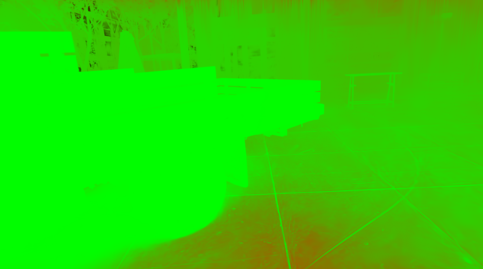 | 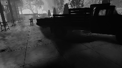 |

### Semantics and open-vocabulary query

AURA lifts multi-view DINO features onto carriers and answers CLIP-style text
queries for group-level retrieval. The same-split A/B promotes a DINOv3
small/timm path (semantic cluster budget 12): truck, wheel, ground, and building
resolve to four distinct groups with an aggregate query margin above the DINOv2
baseline, while DINOv2 keeps the stronger wheel-only margin (both recorded).

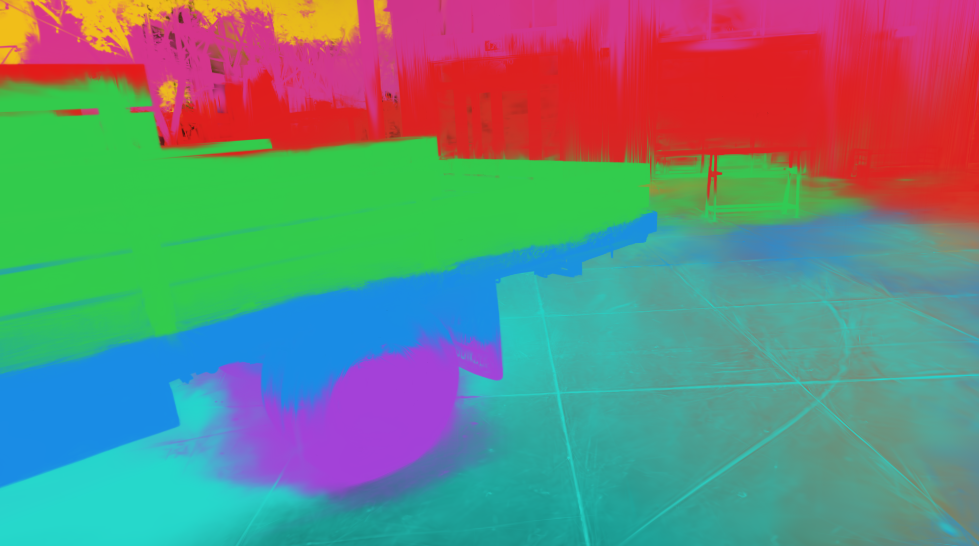

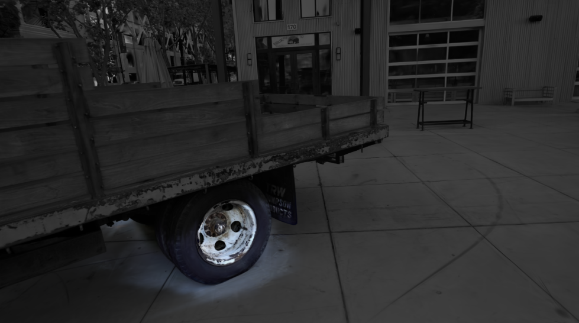

| A/B | DINOv2 | DINOv3 |
|---|---|---|
| 14-view carrier groups | 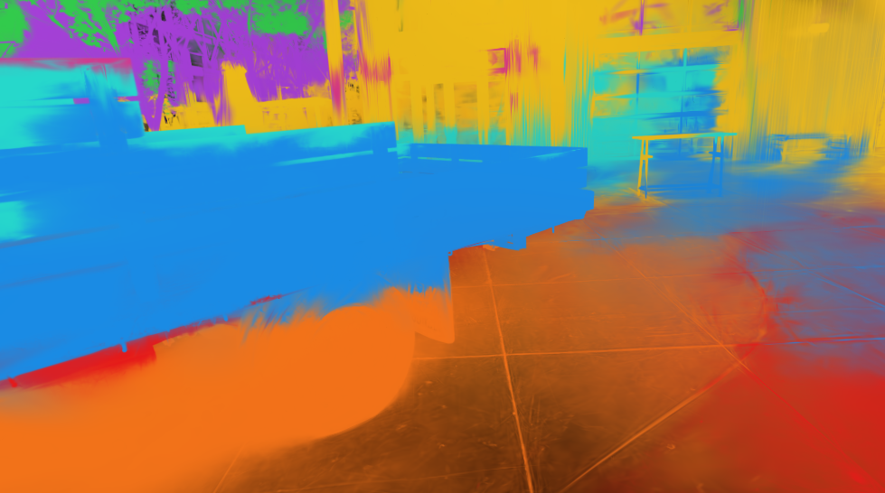 | 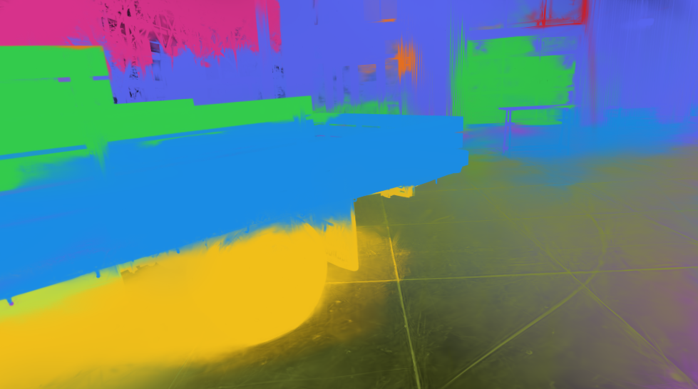 |
| Wheel query highlight | 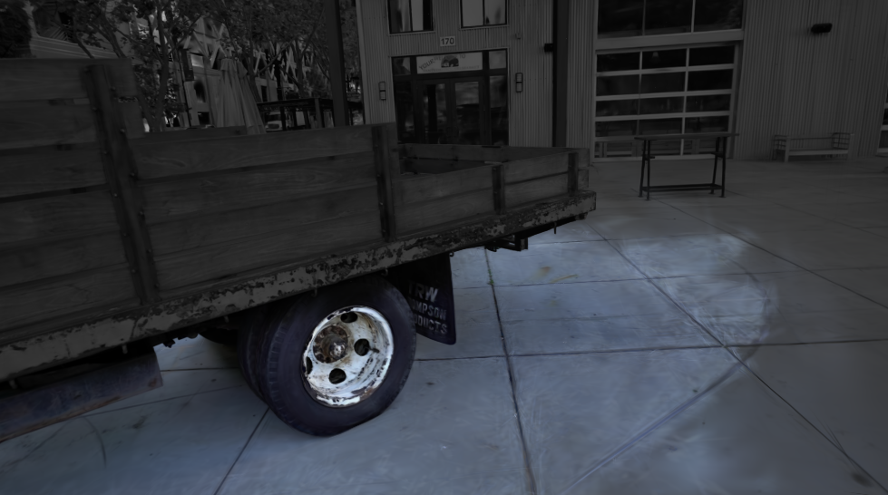 | 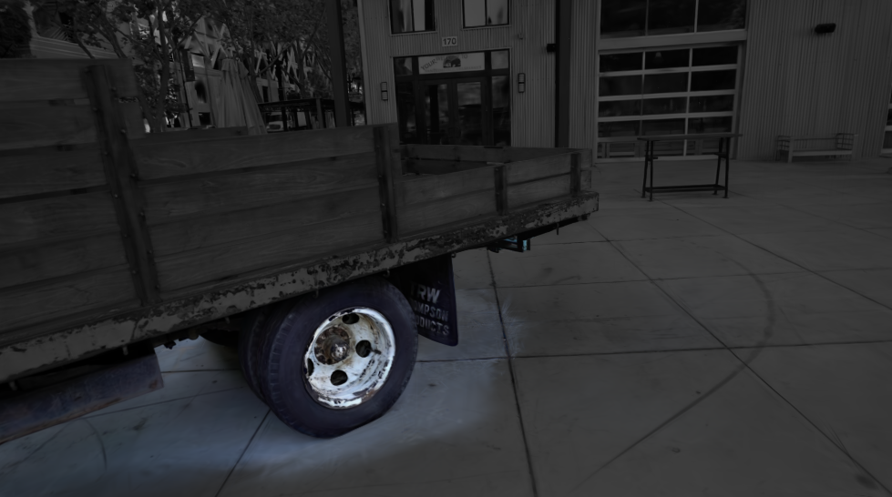 |

**Codebook semantics (LangSplatV2-style).** Heavy per-carrier features do not need to
ship per carrier: a shared **K-entry k-means codebook** (`src/aura/codebook.py`)
holds the feature vectors once, and each carrier stores only a small **uint8/uint16
index**. Open-vocabulary query then costs **O(K·d + N)** — score the K codebook
entries against the query embedding, then fan out to carriers by index — instead of a
dense `O(N·d)` scan. On the committed real truck DINOv2 distillation this compresses
**1.53 GB → 1.05 MB at k=64** (≈1398×, uint8 indices), with reconstruction
relative-error **0.319** (falling as k grows). The library carries the codebook layer
and the semantic contract (labels, `SemanticFeaturePayload`), but no committed
per-carrier feature tensor — so `semantic` stays a **metadata** carrier, and wiring
real feature distillation into the exported asset is the **GPU-gated next step**.
Truth table and the codebook byte-formula: [`docs/P6_CARRIER_REGISTRY_AND_CODEBOOK.md`](docs/P6_CARRIER_REGISTRY_AND_CODEBOOK.md).

### Relight preview

Carriers carry surface/material fields, so the same asset can be previewed under
changed lighting without changing geometry.

```bash
aura relight-preview scene.aura scene/manifest.json --output relit.ppm
```

Scope note: this is a **relighting preview** (albedo from the baked SH DC term,
normals from the carrier covariance short axis), not yet data-driven inverse
rendering — no optimization from observations and no TensoIR/Stanford-ORB
evaluation. It is honest scaffolding for the material path, not an inverse-rendering
claim. The **v0.8 attempt is pre-registered** with a promote-or-descope rule
([`docs/P7_RELIGHT_DECISION.md`](docs/P7_RELIGHT_DECISION.md)): a genuine per-scene
inverse-rendering pass is measured against the object-relighting SOTA that actually
reports on TensoIR-Synthetic / Stanford-ORB (GS-IR, IRGS, SVG-IR, R3DG, PT-IR), and
unless it clears the bar (relight PSNR ≥ 27 dB, albedo PSNR ≥ 27 dB, signed normal
MAE ≤ 8°, ORB within 3 dB) the capability is formally renamed a
"confidence-weighted relighting preview" and the sub-bar numbers published as an
honest negative — the outcome is a measurement, not a narrative.

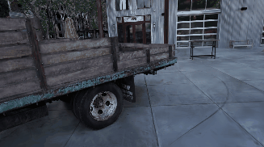

## Exports & interchange

The export path writes real engine-facing assets instead of leaving results as an
experiment-only checkpoint — and the calibrated confidence rides along in every
container.

```bash
aura export-splat scene.aura --output scene.glb            # KHR_gaussian_splatting GLB (+ _AURA_CONFIDENCE)
aura export-spz   scene.aura --output scene.spz            # Niantic SPZ v4 (+ .spz.confidence.npz sidecar)
aura export-usd   scene.aura --output scene.usda           # dependency-free ASCII preview
aura export-usd   scene.aura --schema --output scene.usda  # OpenUSD 26.03 splat schema (+ primvars:aura:confidence)
aura validate-package scene.aura
aura inspect-package  scene.aura
```

- **`KHR_gaussian_splatting` GLB** with position, colour/opacity, rotation, scale,
  and SH payloads — and the calibrated **`_AURA_CONFIDENCE`** vendor attribute. KHR
  status (checked against `KhronosGroup/glTF@main`): the base extension is a
  **Release Candidate** (merged PR #2490, 2026-01-27) and AURA's emitted attribute
  names already match the merged RC schema exactly; the compression extension
  `KHR_gaussian_splatting_compression_spz_2` is an **unmerged v2-only draft and is
  deliberately absent** (`extensionsUsed` lists only the base extension); confidence
  rides as a glTF-core vendor attribute, needing no extension.
- **SPZ v4 export** (`src/aura/spz.py`): a pure-numpy reader/writer for the Niantic
  `.spz` (`NGSP`) container, **cross-validated bit-exact against the reference
  C++** (`nianticlabs/spz` @ `bb0efad`) — files AURA writes decode through the
  reference `loadSpz`, files the reference `saveSpz` writes decode here, and on
  identical bytes the two decoders agree bit-exactly on positions/scales/SH. SPZ v4
  has **no** per-splat confidence channel, so AURA writes calibrated confidence to a
  **`<name>.spz.confidence.npz` sidecar** aligned 1:1 to SPZ point order (the
  `carriers.npz` sidecar pattern). Cross-validation harness:
  `experiments/spz_reference_crossval.cc`.
- **USD export**: a dependency-free ASCII preview bridge for scene-graph / DCC
  workflows, plus the official **OpenUSD 26.03** `UsdVolParticleField3DGaussianSplat`
  schema via `--schema` (native splat prim; confidence written as the idiomatic
  per-particle primvar **`primvars:aura:confidence`**, `interpolation = "vertex"`,
  with a legacy `custom:aura:confidence` fallback reader; requires `usd-core`).
- **`.aura` package + `carriers.npz` sidecar** for fast local rendering/eval.

Third-party viewer compatibility is a **structural** check, not a runtime guarantee.

## Quickstart

```bash
python -m venv .venv && source .venv/bin/activate
pip install --upgrade pip
pip install -e ".[dev,gpu,assets]"
```

For CUDA-first local work use the GPU environment when available
(`source .gpu_venv/bin/activate`). The DBS-Beta fork installs under the `gsplat`
package name and is kept isolated in `.dbs_venv` — never mix the two.

The `data/` tree is gitignored, so a fresh clone has no scenes — fetch one first
(`bash scripts/fetch_scene.sh truck data/tanks/truck`) or point the commands below
at your own COLMAP capture. To reproduce the *paper's* results with no data or GPU
at all, see [`REPRODUCE.md`](REPRODUCE.md) (everything runs from committed artifacts).

```bash
# 0. Fetch a scene (data/ is gitignored; skip if you already have a capture).
bash scripts/fetch_scene.sh truck data/tanks/truck

# 1. Build a capture manifest from COLMAP.
aura colmap-to-capture-manifest data/tanks/truck/sparse/0 \
  --root data/tanks/truck --image-dir data/tanks/truck/images \
  --output outputs/truck-manifest.json --point-seeded

# 2. Train carriers.
aura train-gsplat outputs/truck-manifest.json --output outputs/truck.aura --scale 1.0

# 3. Use the asset.
aura render     outputs/truck.aura --backend torch --output docs/view.ppm
aura export-splat outputs/truck.aura --output docs/truck.glb
aura ray-query  outputs/truck.aura --origin 0 0 0 --direction 0 0 1
```

## Training backends

AURA trains carriers on two mature backends, each in its own isolated venv:
**gsplat** (Gaussian) and a **DBS-Beta fork** (Beta typed carriers). On matched
carrier budgets the Beta path **reproduces the quality result of Deformable Beta
Splatting** (DBS, [arXiv:2501.18630](https://arxiv.org/abs/2501.18630)):

- Beta beats the fixed-Gaussian control on **every** audited scene, **mean +0.80 dB
  PSNR**.
- On Truck at a matched 1M-carrier budget, Beta wins by **+0.33 dB** and reaches
  comparable quality at **~half the carriers**.

This **+0.33 dB reproduces DBS's published claim — it is not an AURA novelty** — and
the control is a **frozen-β DBS ablation, not real gsplat 3DGS**, with Mip-NeRF 360
evaluated at image downsamples. The honest findings that come with it (nobody else
has published these) are the interesting part:

- The typed +dB win **decomposes to a spherical-Beta colour model** (~+0.4 dB), not
  to per-carrier adaptivity (~0).
- **Adaptive per-carrier β does not beat a good global β** (learned 26.352 <
  uniform β=2, 26.421).
- **Cross-family mix-routing never beats the best single family.**
- An earlier +0.8 dB "typed win" was a camera-roll pose-bug artifact (fixed).

### Truck compactness

| Representation | PSNR | SSIM | LPIPS | Carriers |
|---|---:|---:|---:|---:|
| fixed Gaussian | 26.02 | 0.890 | 0.128 | 1.0 M |
| AURA Beta | **26.35** | **0.896** | **0.122** | 1.0 M |
| AURA Beta | 26.07 | 0.890 | 0.139 | **0.5 M** |

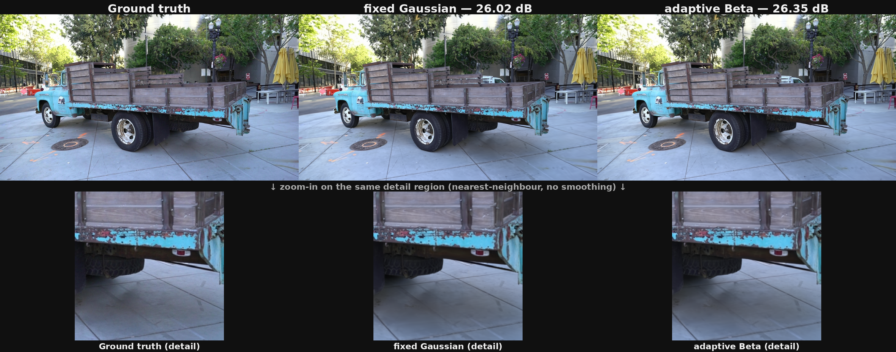

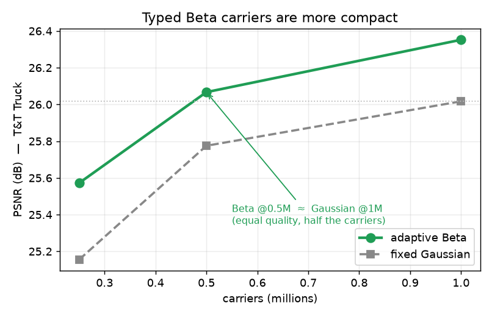

### B2 — the win holds against a real gsplat-3DGS control (Truck, 1/8 scenes)

The multi-scene table above uses a **frozen-β DBS ablation** as the control (`--sb_number 0
--beta_lr 0`), *not* a real 3DGS renderer. The long-standing question was whether that
frozen control was artificially weak — inflating the typed-carrier win. To answer it we ran
a genuine **gsplat-3DGS MCMC** control (`simple_trainer.py mcmc`, `cap_max=1e6`, 30k steps,
same every-8th-view split) at a matched 1M-carrier budget on **Truck**, and the win holds:

| Truck, matched 1M carriers | PSNR | SSIM | LPIPS |
|---|---:|---:|---:|
| **true gsplat-3DGS** (MCMC, final@30k) | 25.94 | 0.890 | 0.125 |
| frozen-β control (DBS ablation) | 25.96 | 0.890 | 0.128 |
| **AURA Beta** (adaptive) | **26.39** | **0.896** | **0.123** |

> This B2 table is a **separate matched-1M-carrier run** from the *Truck compactness*
> table above (which reports 26.02 fixed-Gaussian / 26.35 Beta), so the absolute PSNRs
> differ by ~0.04 dB between runs; the typed-carrier *margin* is what is being compared,
> and it holds in both.

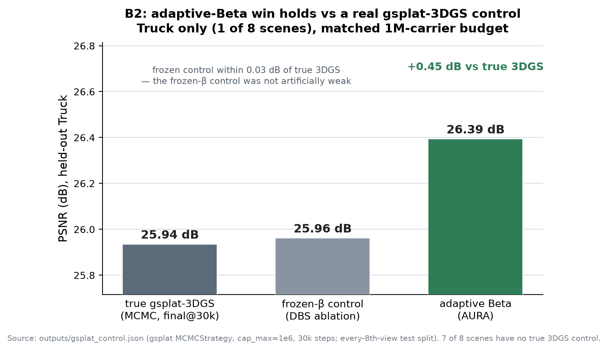

Two honest readings: adaptive Beta beats the true gsplat-3DGS control by **+0.45 dB**, and
the **frozen-β control (25.96) lands within 0.03 dB of true 3DGS (25.94)** — so it was *not*
artificially weak; the typed win is real, not an artifact of a hobbled baseline. **Honest
bound: this true-3DGS control is Truck-only (1 of 8 scenes).** The other seven scenes still
compare against the frozen-β control only, so the headline **+0.80 dB 8-scene mean below is
still measured against the frozen control**, and a further planned quality-backend variant was
left unbuilt. Numbers read
verbatim from `outputs/gsplat_control.json`; regenerate the chart with
`python experiments/make_b2_gsplat_control_figure.py`.

### Multi-scene typed-carrier quality

| Scene | AURA Beta PSNR | Fixed Gaussian PSNR | Delta |
|---|---:|---:|---:|
| bicycle | 25.15 | 24.84 | +0.30 |
| bonsai | 34.03 | 32.27 | +1.76 |
| counter | 30.32 | 28.81 | +1.51 |
| garden | 27.27 | 26.64 | +0.63 |
| kitchen | 32.37 | 31.29 | +1.09 |
| room | 32.78 | 32.29 | +0.49 |
| stump | 26.64 | 26.46 | +0.19 |
| truck | 26.39 | 25.96 | +0.43 |

**Mean gain: +0.80 dB PSNR.**

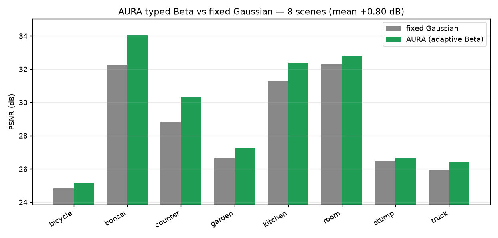 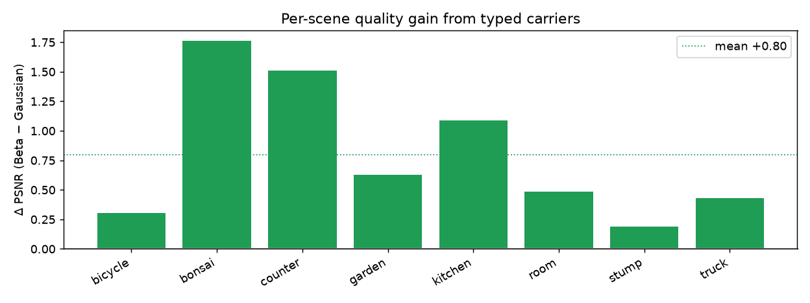

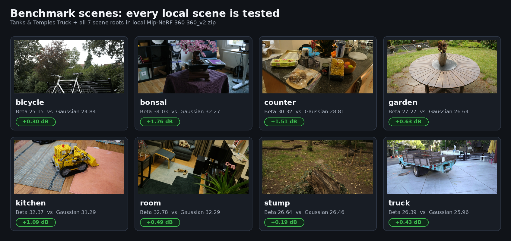

Train is included as local image-sequence and COLMAP-sparse evidence rather than a
trained DBS-Beta checkpoint:

| Train image sweep | Train sparse depth |
|---|---|
|  |  |

## Verification and reproducibility

**Publication gates — 17, content-checked.** The artifact-backed gate report passes
all gates on this workstation:

```text
aura publication-validation-report
publicationReady: true · passedGateCount: 17 · remainingGateIds: []
```

The gate set grew from **11 existence checks to 17 content-checked gates**
(`src/aura/publication.py`): a gate now passes only when the committed real-scene
artifact is *parsed and its numbers meet a threshold* (calibration ECE, pruning
certificate, cross-scene transfer, full-res + render-loss, certified LOD, carrier-
registry honesty, the local/external quality tables), not merely present. Missing,
stale, or malformed data **fails** the gate; the two trained-asset probes
(secondary-ray, inverse-materials) return an explicit `unverified` / `requires_gpu`
state when the large GPU-produced asset is absent — a distinct state from `failed`,
never a silent pass. This is an **artifact-backed local A/B gate, not an official
leaderboard**.

**Split guard.** The calibration gate is wrapped by `aura.split_guard`, which makes
the historical P0 eval-leak class (held-out reliability views that were seen in
training) **mechanically impossible** — it rejects any recorded view partition that
is not a clean disjoint holdout.

**CI.** GitHub Actions runs the CPU-testable suite on Python 3.11 and 3.12 on every
push and PR (`.github/workflows/ci.yml`; badge above), via
`pytest -m "not gpu and not local_data"`.

**CPU-only reproduction.** [`REPRODUCE.md`](REPRODUCE.md) is a verified, GPU-free
walkthrough that reproduces the calibrated-confidence, certificate, and certified-LOD
results **bit-for-bit** from the committed artifacts (every recompute script fixes
seed 0 and the same 50/50 split, so the recomputed JSON is byte-identical to the
committed file; `git diff` is empty). A fresh clone content-checks **15/17** gates,
with exactly the two trained-asset probes `unverified` by design.

**Render speed.** Trained Truck checkpoints render above 30 FPS on an RTX 5090 —
DBS-Beta 46 FPS, fixed-Gaussian control 49 FPS (979×546,
`experiments/results/real_scene_fps_sweep_2026-06-25.json`). This is a
trained-checkpoint render-speed measurement, not a full-scene leaderboard FPS
claim.

**External same-split baselines.** Local smoke rows plus official 2DGS and 3DGUT
run as 30k same-split GPU rows on all 8 audited scenes
(`experiments/results/external_baselines_2026-06-24.json`,
`official_multiscene_baselines_2026-06-25.json`):

| Baseline row | PSNR | SSIM | LPIPS | Boundary |
|---|---:|---:|---:|---|
| COLMAP sparse SfM | 8.9952 | 0.049027 | 0.757455 | local CUDA smoke |
| compact NeRF | 8.6726 | 0.126395 | 0.971559 | local 1-iter CUDA smoke |
| 3DGS frozen-β control (DBS ablation) | 26.0172 | 0.890420 | 0.127743 | frozen-Gaussian control — NOT the true gsplat-MCMC control (see [B2](#b2--the-win-holds-against-a-real-gsplat-3dgs-control-truck-18-scenes)) |
| 2DGS-style surfel | 10.7072 | 0.177134 | 0.645361 | local smoke/protocol row |
| ray-traced-GS-style | 6.7688 | 0.066934 | 0.822136 | local smoke/protocol row |
| official 2DGS Truck | 25.1223 | 0.873086 | 0.173525 | official repo, 30k steps, Truck native |
| official 3DGUT Truck | 25.3198 | 0.878045 | 0.183758 | official repo, 30k steps, Truck native |
| official 2DGS Room | 30.5354 | 0.906617 | 0.243403 | official repo, 30k steps, Mip-360 Room images_2 |
| official 3DGUT Room | 31.4958 | 0.918965 | 0.296945 | official repo, 30k steps, Mip-360 Room ds=2 |
| official 2DGS Bicycle | 24.5921 | 0.711770 | 0.306886 | official repo, 30k steps, Mip-360 Bicycle images_2 |
| official 3DGUT Bicycle | 24.3068 | 0.696055 | 0.359877 | official repo, 30k steps, Mip-360 Bicycle ds=2 |
| official 2DGS Bonsai | 31.2977 | 0.931000 | 0.226856 | official repo, 30k steps, Mip-360 Bonsai images_2 |
| official 3DGUT Bonsai | 32.4276 | 0.944540 | 0.251687 | official repo, 30k steps, Mip-360 Bonsai ds=2 |
| official 2DGS Counter | 28.0533 | 0.893028 | 0.229328 | official repo, 30k steps, Mip-360 Counter images_2 |
| official 3DGUT Counter | 29.1397 | 0.910729 | 0.257860 | official repo, 30k steps, Mip-360 Counter ds=2 |
| official 2DGS Garden | 26.6861 | 0.833891 | 0.164357 | official repo, 30k steps, Mip-360 Garden images_2 |
| official 3DGUT Garden | 26.3824 | 0.801139 | 0.241828 | official repo, 30k steps, Mip-360 Garden ds=2 |
| official 2DGS Kitchen | 30.2164 | 0.915704 | 0.147227 | official repo, 30k steps, Mip-360 Kitchen images_2 |
| official 3DGUT Kitchen | 30.8491 | 0.926038 | 0.159499 | official repo, 30k steps, Mip-360 Kitchen ds=2 |
| official 2DGS Stump | 26.0513 | 0.749460 | 0.293722 | official repo, 30k steps, Mip-360 Stump images_2 |
| official 3DGUT Stump | 26.3474 | 0.758430 | 0.360993 | official repo, 30k steps, Mip-360 Stump ds=2 |

Completed counts: official 2DGS 8/8 scenes, official 3DGUT 8/8 scenes, local
**frozen-β control 8/8 scenes**. Note the distinction: this frozen-β/fixed-Gaussian
control (the `26.0172` row above and the multi-scene table's control column) is a
DBS ablation, *not* a real 3DGS renderer — the **true gsplat-3DGS MCMC control is
Truck-only (1/8), reported separately in [B2](#b2--the-win-holds-against-a-real-gsplat-3dgs-control-truck-18-scenes)**.
The SOTA A/B artifact (`sota_ab_validation_2026-06-25.json`) promotes the
DINOv3-small/timm, official 2DGS, and 3DGUT providers.

The GPU pipeline that regenerates everything from raw captures (accuracy jobs run
fine on shared GPUs; only FPS rows need an idle machine):

```bash
bash scripts/fetch_scene.sh truck data/tanks/truck
bash experiments/run_multiscene.sh 7000 1 && python experiments/collect_multiscene.py
python experiments/per_carrier_reliability.py --aura outputs/<scene>-gsplat.aura \
  --manifest outputs/<scene>-manifest.json --out outputs/reliability_<scene>.npz
python experiments/calibrate_confidence.py --reliability outputs/reliability_<scene>.npz \
  --scene <scene> --report outputs/calib_<scene>.json
python experiments/cross_scene_transfer.py   # P1a transfer matrix
python experiments/cert_sweep.py             # P1b certificate operating study
bash experiments/run_p2.sh room 0            # P2 full-res + render-loss (per scene)
python experiments/collect_p2.py             # -> outputs/p2_summary.json
python experiments/lod_certified_eval.py     # P4 certified LOD plan -> outputs/lod_certified.json
python experiments/bvh_query_benchmark.py    # P5 BVH parity + throughput -> outputs/bvh_query_benchmark.json
python experiments/make_hardening_figures.py # the four result figures above
python experiments/make_pruning_sweep_gif.py --scene room --frame 8
aura publication-validation-report --output experiments/results/publication_validation.json
```

## Limitations and claim boundary

AURA is a research preview; the honest boundary is part of the product.

- **Local artifact-backed A/B readiness only — no official-leaderboard SOTA claim**,
  and no production-FPS-everywhere claim.
- The typed-carrier quality win **reproduces DBS**; it is not an AURA novelty. The
  8-scene mean is measured against a frozen-β control (not real gsplat 3DGS), with
  Mip-360 eval at image downsamples. A **true gsplat-3DGS MCMC control was added for
  Truck only** ([B2](#b2--the-win-holds-against-a-real-gsplat-3dgs-control-truck-18-scenes)),
  where the win holds (+0.45 dB) and the frozen control is within 0.03 dB — but the
  other 7 scenes have no true 3DGS control.
- **Ray query is a CPU BVH validated for parity**, not a GPU wall-clock match against
  the 3DGRT/3DGUT CUDA tracers; secondary rays remain readiness probes, not a
  physically-based tracer.
- **Relighting is a preview** (baked-SH albedo, covariance normals), not data-driven
  inverse rendering; the v0.8 promote-or-descope rule is pre-registered.
- **Only Gaussian and Beta train on real scenes**; Gabor is 2D-crop-only and Neural
  is experimental (both additive PRISM extensions). `semantic` is a metadata carrier
  — the codebook layer is CPU-validated but no per-carrier feature tensor ships in
  the asset yet.
- The P0 reliability label is a **colour-agreement proxy** and the occlusion buffer
  is a coarse block z-buffer — both conservative. The render-loss label (P2) is
  render-grounded but its garden pass is rendered at half resolution (17.4 MP raster
  OOMs on the shared GPUs). Certified-LOD `ε` bounds reliability mass, not PSNR.
- Third-party viewer compatibility is a **structural** check, not a runtime
  guarantee. The custom CUDA path is sm_120-only (RTX 5090).
- Reliability is evaluated on **4 real scenes** (Truck, Garden, Kitchen, Room); the
  wider **8-scene** quality set does not yet carry measured baseline-vs-candidate entries
  for every Mip-NeRF-360 scene (see the frozen-control caveat under *v1.0 Known Limitations*).

## v1.0 Known Limitations

`v1.0.0` ships the calibrated-confidence trust layer complete and honestly bounded.
It does **not** close every item on the pre-release ladder, and — consistent with this
project's ethos that negatives are published, not hidden — the open items are listed
here as *open*, not implied done. Dated, per-change history lives in
[`CHANGELOG.md`](CHANGELOG.md); the per-capability claim boundary is above.

**Scope of the evidence (open, would harden the result):**

- **The true gsplat-3DGS control is Truck-only (1 of 8 scenes).** The [B2](#b2--the-win-holds-against-a-real-gsplat-3dgs-control-truck-18-scenes)
  MCMC control confirms the typed-carrier win on Truck (+0.45 dB vs real 3DGS; the
  frozen-β control within 0.03 dB, so it was not artificially weak). The other seven
  scenes still compare against the frozen-β DBS ablation only, so the headline **+0.80 dB
  8-scene mean remains a frozen-control number**. A **further planned quality-backend variant
  was left unbuilt** (no trainer for it in this repo).
- **No external reproduction; no P3 independent re-captures.** The reliability story is
  validated on four single-capture scenes under two labels, with a CPU-only bit-for-bit
  reproduction from committed artifacts ([`REPRODUCE.md`](REPRODUCE.md)) — but no outside
  party has reproduced it, and there are no independent re-captures of the same scenes.
- **Garden's native 17.4 MP render-loss label is rendered at half resolution** (the
  full-res raster OOMs under concurrent GPU load); its carriers and its colour/occlusion
  labels are native. Four scenes is a small reliability sample, and the wider 8-scene quality
  set does not yet carry measured baseline-vs-candidate entries for every Mip-NeRF-360 scene
  (the 8-scene mean is a frozen-control number, as noted above).

**Preview / demo-stage capabilities (shipped as scaffolding, labelled as such):**

- **Relighting is a preview**, not data-driven inverse rendering (albedo = baked SH-DC,
  normals = unsigned covariance short axis). This is a **pre-registered descope**: the
  v0.8 promote-or-descope bar ([`docs/P7_RELIGHT_DECISION.md`](docs/P7_RELIGHT_DECISION.md))
  was not attempted at bar for this release, so the capability stays a preview by rule.
- **Ray query is a CPU-BVH parity result, not a GPU wall-clock match.** The BVH is proven
  bit-for-parity with brute force (0 mismatches, incl. 300 rays on the real truck asset),
  but matching the CUDA 3DGRT/3DGUT tracers' GPU wall-clock is the **deferred bar**;
  secondary rays remain readiness probes, not a physically-based tracer.
- **Only Gaussian and Beta are trained carriers.** Gabor is 2D-crop-only, Neural is an
  experimental provenance-annotated Gaussian fallback, and Surface / Volume / Semantic are
  **metadata contracts** — the semantic codebook layer is CPU-validated but no per-carrier
  feature tensor ships in the asset. The v0.7b attempt to make Gabor a real trained third
  carrier was not landed, so the registry stays honestly scoped to two trained types.

**Established honest negatives (not open questions — measured and kept):**

- **Adaptive per-carrier β does not beat a good global β** (learned 26.352 < uniform β=2,
  26.421). The typed +dB win decomposes to a spherical-Beta *colour* model (~+0.4 dB), not
  to per-carrier adaptivity (~0).
- **Cross-family mix-routing never beats the best single family.**
- These are publishable negatives (nobody else has published them); they are not defects to
  be fixed but findings that bound the contribution.

## Repository map

```text
src/aura/
  calibration.py      calibrated confidence + conformal pruning certificate (P0)
  confidence.py       raw per-carrier confidence signal
  lod.py              certified LOD/streaming plan (P4)   split_guard.py  eval-leak guard
  bvh.py              median-split carrier BVH (P5)       carrier_query.py  ray-query payloads
  codebook.py         k-means semantic codebook (P6)      carriers.py  typed-carrier registry + maturity
  gltf_splat.py       KHR_gaussian_splatting export (+ _AURA_CONFIDENCE)
  spz.py              Niantic SPZ v4 reader/writer (+ confidence sidecar)
  usd_writer.py       OpenUSD 26.03 UsdVolParticleField3DGaussianSplat schema
  hybrid.py           primary backend + PRISM extension routing
  prism.py            torch PRISM rasterizer      prism_cuda.py  CUDA PRISM path
  relight.py          relighting preview layer
  publication.py      17-gate content-checked report  readiness.py  production boundary
  carrier_io.py       fast carriers.npz sidecar   schemas/  .aura package schemas

scripts/       dataset, eval, baseline, and DBS bridge utilities
experiments/   reproduction scripts, figure/GIF generators, SPZ crossval harness
tests/         contract, renderer, validation, and CLI tests
docs/          README figures, GIFs, and the P0/P1/P2/P4/P5/P6/P7 deep-dives
assets/        P0-P2 result figures + the pruning-sweep animation
```

## License

MIT. See [LICENSE](LICENSE).
