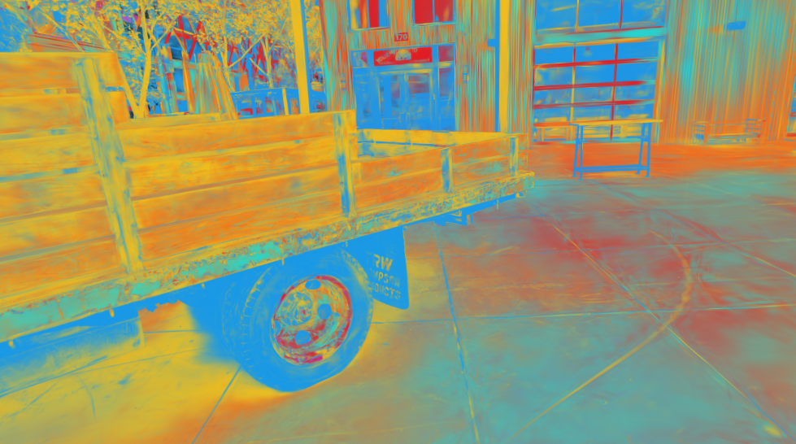

# AURA — visual gallery

All on Tanks & Temples — **Truck**, rendered through the trained carriers. Numbers
and scripts are in [`../README.md`](../README.md) and `../experiments/`.

## Reconstruction (hero)

Smooth fly-through of the AURA reconstruction (adaptive Beta carriers, **26.4 dB**),
via an interpolated camera path (`experiments/render_turntable.py`).

## The lineage it extends

Ground truth · COLMAP SfM points · NeRF · vanilla 3DGS · AURA — same correct poses.

## Typed carriers beat fixed Gaussians

Held-out view: GT · fixed Gaussian (26.02) · adaptive Beta (26.35), with a zoom crop.

Beta reaches equal quality at **half** the carriers (Beta@0.5M ≈ Gaussian@1M).

## Cross-family carrier fit (the routing question)

Gabor (more expressive) beats Gaussian on every crop, but **mix-routing does not beat
the best single family** — per-region routing isn't the lever; expressive carrier
type is. (`experiments/prism_crossfamily.py`)

## Asset-contract capabilities (what raw 3DGS can't do)

### Relighting

A directional light orbits the scene; per-carrier normals + albedo are re-shaded and
rendered sharply through the Beta rasterizer (`experiments/relight_fork_gif.py`).

### Per-carrier confidence

Carriers coloured by multi-view observation support — green = well-observed,
red = speculative floaters (`experiments/confidence_viz.py`).

### Semantic grouping (scaffold)

Unsupervised (position+colour) carrier groups — wheel / bed / ground / background
separate; the `semantic_id` slot the ray query returns (`experiments/semantic_viz.py`).

### Geometry / depth (the ray-query reads this)

Expected-depth orbit (near = dark, far = light).
