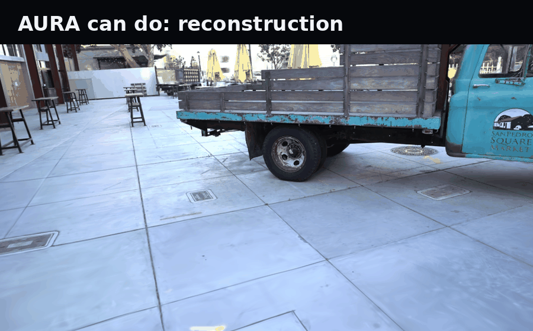

# AURA — the trust layer for splats

A plain 3DGS/DBS checkpoint renders fast but ships no notion of per-primitive
trust. AURA keeps those fast Gaussian / DBS-Beta renderers where they are
strong and adds the layer they do not provide: a **calibrated confidence**
every carrier carries, turned into a **distribution-free certificate**, turned
into a **certified streaming/LOD ladder** — with that confidence **travelling
in every standard container** (glTF, USD, SPZ), all of it **gate-checked and
CPU-reproducible**.

The chain is Photogrammetry → NeRF → 3DGS → **AURA**: not a faster renderer,
but a more *trustworthy, inspectable* asset on top of one.



## Install

```bash
pip install aura-splat        # 1.1.0 · Python 3.11+
# or from source: pip install -e ".[dev,gpu,assets]"
```

Then follow [Quickstart](quickstart.md): fetch a scene, train carriers, render,
export, ray-query.

## Evidence (v1.1.0)

| Area | Result |
|---|---|
| Full suite | **1928 passed**, 37 skipped, 0 failed — CPU-reproducible |
| Certificate bounds | **16/16** split-conformal bounds hold |
| LOD ladder | Certified streaming ladder with calibrated per-carrier confidence |
| Interchange | Confidence survives glTF, USD (`primvars:aura:confidence`), SPZ round-trips |
| Open artifacts | DOI [10.5281/zenodo.21500723](https://doi.org/10.5281/zenodo.21500723) · `REPRODUCE.md` replays the paper with no data or GPU |

## Scope (honest bounds)

No official-leaderboard SOTA claim anywhere in this repo. Open items are stated
as open: a full 8-scene true-3DGS control, external reproduction, and a handful
of demo-stage carriers. Negatives are kept, not hidden.

## Guides

Start with [Quickstart](quickstart.md), then read the passes in order:
calibrated confidence → distortion budget → cross-scene → full-res render loss
→ certified LOD → BVH ray query → carrier registry → relight decision.

## Related

- [SplatReg](https://archerkattri.github.io/splatreg/) — register and merge 3DGS scans (sibling 3DGS project)
- [Research portfolio](https://archerkattri.github.io/) — the full certified-systems map
- [Code](https://github.com/Archerkattri/aura) · [Release v1.1.0](https://github.com/Archerkattri/aura/releases/tag/v1.1.0) · [PyPI](https://pypi.org/project/aura-splat/)
